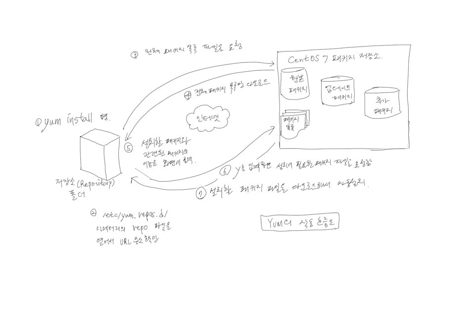

### 프로그램 설치를 위한 RPM

### 4.4.1. 프로그램 설치를 위한 Redhat Package Manager
> yum이 나오기전 rpm을 주로 사용했음.

> yum은 rpm의 개념과 기능을 포함하기 때문에 최신 버전 CentOS에서는 yum을 사용하면된다.

> yum은 rpm을 확장한 개념에 가까우므로 rpm의 개념을 익혀야 한다.

#### RPM

> Windows에 설치 파일이 있듯이 *.rpm 확장명의 설치 파일, package라고 부른다.

- 파일의 의미

> rpm 파일의 형식을 일반적으로 아래와 같다.

> 패키지이름-버전-릴리스번호.CentOS버전.아키텍처.rpm

```
[root@localhost ~]# find -name *.rpm
./다운로드/flash-player-npapi-32.0.0.171-release.x86_64.rpm
```

> 패키지이름: flash-player-npapi

> 버전: 32.0.0

> 릴리스번호: 171-release

> CentOS버전: ? - CentOS에서 배포할 경우 붙여진다.

> 아키텍처: x86_64

- 자주 사용하는 rpm 명령어 옵션

설치
```bash
rpm -Uvh 패키지파일이름.rpm
```

> U(대문자) -> 기존에 패키지가 설치되지 않았다면 일반적인 설치를 하고, 기존에 패키지가 설치되어 있다면 업그레이드한다.

> 'i' 옵션은 설치되어 있다면 오류가 발생하므로, 'U'옵션이 더 편하다.

> v -> 설치 과정 확인

> h -> 설치 진행 과정을 '#'기호로 화면에 출력

삭제
```
rpm -e 패키지이름
```

> e -> erase

이미 설치된 패키지 조회
```bash
rpm -qa 패키지이름 - 시스템에 패키지가 설치되었는지 확인
rpm -qf 파일의절대경로 - 이미 설치된 파일이 어느 패키지에 포함된 것인지 확인
rpm -ql 패키지이름 - 특정 패키지에 어떤 파일들이 포함되었는지 확인
rpm -qi 패키지이름 - 설치된 패키지의 상세 정보
```

아직 설치되지 않은 rpm 파일 조회
```
rpm -qlp 패키지파일이름.rpm - 패키지 파일에 어떤 파일들이 포함되었는지 확인
rpm -qip 패키지파일이름.rpm - 패키지 파일의 상세 정보
```

- RPM의 단점
> 가장 큰 문제점은 '의존성'문제다.

> X 윈도가 설치되지 않은 상태에서 Firefox를 설치한다면? 설치가 되지 않을 것이다.

> 이런 불편한 점을 해결한 것이 'yum'명령어다.

> 의존성있는 rpm 설치하면 오류, yum으로 편리하게 설치. This is like the yarn.

### 4.4.2 편리하게 패키지를 설치하는 YUM

Yellowdog Updater Modified

#### YUM

> yum 명령어는 rpm 명령어의 패키지 의존성 문제를 완전하게 해결해준다.

> 특정 패키지를 설치하고자 할 때 의존성이 있는 다른 패키지를 자동으로 먼저 설치해주는 인공지능을 갖춘 명령어이다.

> 그리고 rpm은 파일이 있거나 미리 다운로드해야 하지만 yum은 CenOS 프로젝트가 제공하는 rpm 파일 저장소Repository에서 설치 할
> rpm 파일은 물론이고 해당 파일과 의존성이 있는 다른 rpm 파일까지 인터넷을 통해 모두 알아서 다운도르한 후 자동으로 설치한다.

>인터넷에 정상적으로 연결된 상태여야 한다.

#### YUM의 기본 사용법
 * 기본 설치 방법
 ```
 # yum -y install 패키지이름
 ```
> -y 옵션은 사용자에게 yes/no를 묻는 부분에서 무조건 yes를 입력한 것으로 간주하고, 자동으로 넘어가서 편리하다.

 * rpm 파일 설치 방법
 ```
 # yum localinstall rpm파일이름.rpm
 ```
 > 'rpm -Uvh' 대신 'yum localinstall'을 실행해 패키지를 설치할 수 있다.
 
 > 좋은 점은 현재 디렉터리의 rpm 파일에 의존성 문제가 있을 때 문제를 해결할 수 있는 파일을 인터넷에서 다운로드해서 설치해 준다는 점이다.
 
 > 'rpm -Uvh rpm파일이름.rpm' 대신에 사용하면 된다.

- 업데이트 가능한 목록 보기
```
# yum check-update
```
> 시스템에 설치된 패키지 중에서 업데이트가 가능한 패키지의 목록을 출력한다.

- 업데이트
```
# yum update 패키지이름
```
> update는 별로 사용할 필요가 없다. 'yum install 패키지이름'을 실행하면 기존에 설치되지 않은 패키지는 새로 설치install하고, 이미 설치되어 있다면 업데이트한다.

> 아무런 옵션을 정하지 않고 'yum update'만 실행하면 업데이트 가능한 모든 패키지를 업데이트해주므로, 시간이 무척 오래 걸릴 것이다.

- 삭제
```
# yum remove 패키지이름
```
> 기존 설치된 패키지를 제거한다.

- 정보 확인
```
# yum info 패키지이름
```

> tip: 설치 할 때 yes를 입력하면 CenOS 프로젝트에서 운영하느 사이트에 접속을 시도한다. 그런데 종종 접속이 되지 않을 때가 있다. 그럴 경우 'yum' 명령어는 자동으로 다른 미러 사이트(Mirror site)에 접속을 시도한다. 메시지 중에 'Trying other mirror'라는 메시지가 나오면 정상적으로 접속되는 미러 사이트를 찾는 과정임을 알아두자.

#### YUM 고급 사용법

- 패키지 그룹 설치( "" 주의 )
```
# yum groupinstall "패키지그룹이름"
```

> 패키지 그룹 설치는 패키지 그룹에 포함되는 패키지들을 통째로 설치할 때 사용할 수 있다. 패키지 그룹 종류는 <pre><code>yum grouplist</code></pre> 으로 확인 할 수 있다. 또, 설치할 때 피키지 그룹의 이름은 주로 띄어쓰기가 많으므로 꼭 ""안에 써야한다.

```
[root@localhost ~]# yum grouplist
Loaded plugins: fastestmirror, langpacks
There is no installed groups file.
Maybe run: yum groups mark convert (see man yum)
Loading mirror speeds from cached hostfile
 * base: ftp.neowiz.com
 * extras: mirror.kakao.com
Available Environment Groups:
   최소 설치
   계산 노드
   인프라 서버
   파일 및 프린트 서버
   기본 웹 서버
   가상화 호스트
   서버 - GUI 사용
   GNOME 데스크탑
   KDE Plasma Workspaces
   개발 및 창조를 위한 워크스테이션
Available Groups:
   개발용 도구
   과학기술 지원
   그래픽기반 관리 도구
   레거시 UNIX 호환성
   보안 도구
   스마트카드 지원
   시스템 관리
   시스템 관리 도구
   콘솔 인터넷 도구
   호환성 라이브러리
Done
```

- 패키지 리스트 확인
```
# yum list 패키지이름
```

> CentOS에서 제공하는 패키지 리스트를 보여준다. 예로 'yum list'을 실행하면 모든 패키지 목록을 보여주며, 'yum list httpd*'를 실행하면 httpd이라는 이름이 들어간 패키지 목록을 보여준다. 그리고 'yum list available'을 실행하면 현재 설치가능한 목록을 보여준다.

- 특정 파일이 속한 패키지 이름 확인
```
# yum provides 파일이름
```
> 특정 파일이 어느 패키지에 들어 있는지를 확인할 수 있다.

- GPG 키 검사 생략
```
# yum install --nogpgcheck rpm파일이름.rpm
```
> CentOS 7에서 인증되지 않은 rpm 파일을 'yum localinstall'로 설치하면 설치되지 않는 경우도 있다. 그럴 경우 '--nogpgcheck' 옵션을 사용하면 GPG 키 인증을 생략하므로 설치할 수 있따.

- 기존 저장소 목록 지우기
```
# yum clean all
```
> 기존에 다운로드한 패키지 목록을 지운 다음 yum install을 실행하면 새로 패키지 목록을 다운로드한다.

#### YUM의 작동 방식과 설정 파일
> 'yum'명령어와 관련된 설정 파일은 **/etc/yum.conf** 와 **/etc/yum.reps.d/** 디렉터리가 있다.

> 다음은 'yum install 패키지이름'을 입력하면 작동하는 순서이다.

1 yum install 입력
2 /etc/yum.repos.d/ 디렉터리의 repo 파일을 열어서 URL 주소 확인
3 전체 패키지 목록 파일을 요청
4 전체 패키지 목록 파일만 다운로드
5 설치할 패키지와 관련된 패ㅑ키지의 이름을 화면에 출력
6 y를 입력하면 설치에 필요한 패키지 파일을 요청함
7 설치할 패키지 파일을 다운로드해서 자동 설치



> CentOS 7 패지키 저장소의 원본 패키지는 **etc/yum.reps.d/CentOS-Base.repo** 파일의 [base]부분에 적혀있다.

> repo 파일을 살펴보자
# 주석
- name: 저장소 이름
- mirrorlist: 전 세계의 저장소가 URL을 통해 연결되어있다.
- baseurl: URL이 적혀 있어야 한다. http, ftp, file 3가지 중 하나
- gpgcheck: 패키지의 GPG 서명을 확인할지 여부를 지정 1 사용 0 안함
- gpgkey: 아스키 GPG 키가 들어 있는 저장소의 URL
- enabled: 이 저장소를 사용할지 여부를 지정 1 사용 0 안함 - 생략 1


