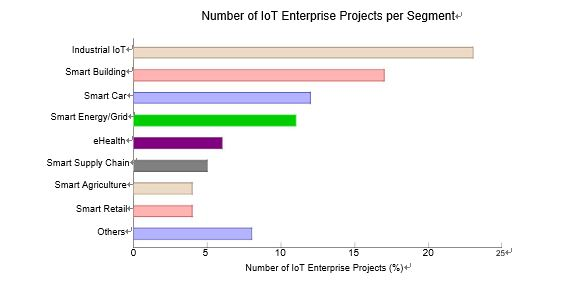
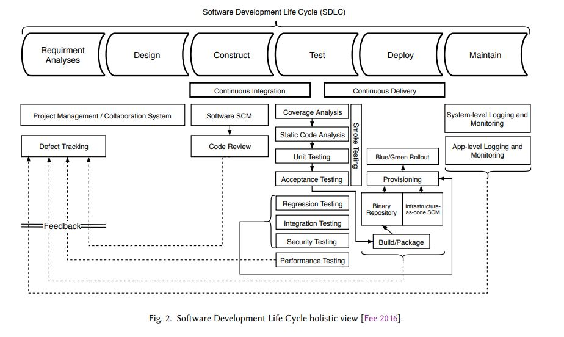
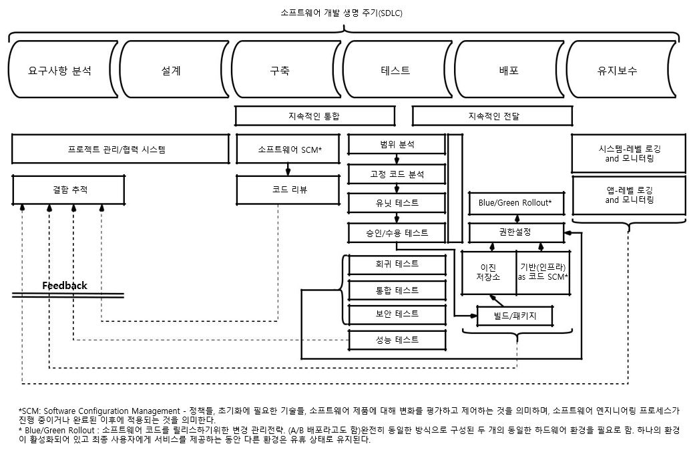
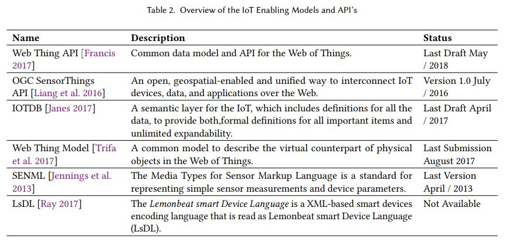

## State of the Software Development Life-Cycle for the Internet-of-Things

- JOÃO PEDRO DIAS, Faculty of Enginnering, University of Porto, Portugal 
- HUGO SERENO FERREIRA, Faculty of Enginnering, University of Porto, Portugal

원문<https://arxiv.org/abs/1811.04159>

 소프트웨어는 성공률을 고려하여 위기 상황과 오랜 연관성이 있습니다. 인터넷 연결 장치 (Internet-of-Things)의 폭발적 증가로 인해 소프트웨어 시스템이 복잡해졌습니다. 대규모 시스템과 이질성 시스템과 같은 시스템의 특성은 점차 새로운 도전 과제를 제기합니다. 이 논문에서는 먼저 소프트웨어 개발의 IoT 패러다임과 현재의 상태를 간략하게 소개한다. 그런 다음, IoT 시스템 및 시스템 시스템 용 소프트웨어를 개발하는 특이성에 대해 살펴보고, 그러한 시스템을 설계, 개발 및 테스트하기위한 현재의 방법론 및 도구가 무엇인지 살펴 봅니다. 발견 된 내용을 토의하여 미해결 문제와 연구 방향을 밝히고 요즘 IoT 소프트웨어 개발 사례가 현재 베스트 프랙티스보다 뒤떨어져 있음을 밝힙니다.

CCS 개념 : • 소프트웨어 및 엔지니어링 → 소프트웨어 생성 및 관리; 초대형 시스템; 개발 프레임 워크 및 환경; 소프트웨어 테스트 및 디버깅; • 컴퓨터 시스템 조직 → 임베디드 및 사이버 물리적 시스템;

추가 핵심 단어 및 구문 : 소프트웨어 엔지니어링, Internet-of-Things

ACM 참조 형식:
João Pedro Dias와 Hugo Sereno Ferreira. 인터넷의 사물에 대한 소프트웨어 개발 생명주기의 상태. ACM 계산. Surv. 9, 4, Article 39 (2018 년 3 월), 38 쪽. https://doi.org/0000001.0000001

### 1. 소개

소프트웨어는 성공률을 고려하여 위기 상황과 장기간 관련되어 있습니다. 개발자의 관점에서 소프트웨어 시스템을 개발하는 것은 어렵습니다. 개발자는 이러한 시스템을 개발하는 동안 버그를 도입하는 경향이 있습니다.

최근 유비쿼터스 연결 및 컴퓨팅의 최고봉 인 IoT (Internet-of-Things)라고도하는 컴퓨팅 기능을 갖춘 인터넷 연결 장치가 폭발적으로 늘어남에 따라 소프트웨어 시스템이 복잡해졌습니다. IoT의 주요 성공 요소 중 하나는 사용 가능한 장치 및 서비스가 원활하게 상호 연결될 수 있는지 여부에 달려 있습니다.
그러나 이것은 이미 소프트웨어 프로젝트 개발의 성공률에 영향을 미칠 수있는 복잡성의 증가로 이어집니다. IoT 시스템의 본질은 (1) 초대형, (2) 고도로 동적 인 토폴로지, (3) 매우 이질성이있는 것, (4) 멀티 도메인 특성을 특징으로합니다. 함께, 그것들을 설계, 개발 및 유지하는 방법에 대한 점점 더 많은 새로운 도전이 제기됩니다.

본고에서는 소프트웨어 개발 라이프 사이클의 3 단계, 즉 소프트웨어 시스템의 설계, 개발 및 테스트에 초점을 맞추어 IoT의 소프트웨어 엔지니어링 관행의 현재 상태에 대한 분석을 탐구합니다.

### 2 배경

#### 2.1 Internet-of-Things

 Internet-of-Things (IoT)는 인터넷 구조 내에서 고유하게 식별 가능한 객체 (사물)와 가상 표현으로 구성된 패러다임입니다 [Barricelli and Valtolina 2015]. 대체로, 이것은 장치의 문맥 인식, 감지 기능 및 자율과 함께 일반 장치 간의 상호 연결성을 나타냅니다 [Hossain et al. 2015]. IoT에 관한 글로벌 표준 구상 (IoT-GSI)은 IoT를 정보 사회의 기반 시설로 정의한다 [Kafle et al. 2016], 새로운 스마트 공간으로의 진보를 예견 함 [Korzun et al. 2013]에 의해 유비쿼터스 컴퓨팅 [Friedemann and Floerkemeir 2011]의 수단에 의해 개발되었다.

 IoT 패러다임은 삶과 삶의 질을 향상시키는 스마트 도시, 인프라 및 서비스의 실현을 가능케하는 사물과 인간 사이의 새로운 유형의 상호 작용을 구축 할 새로운 혁신에 대한 문호를 열어줍니다. 따라서 IoT는 도시와 인프라의 관리가 덜 복잡하고 의료 서비스가 편리하게 접근 가능하며 재해 복구가보다 효율적이기 때문에 삶의 질이 향상되는 새로운 연결 장치 및 인간 세계를 구상합니다 [Buyya and Dastjerdi 2016] .

 기술적 측면에서 볼 때, IoT의 주요 역할은 매우 복잡한 지식 기반 및 동작 지향 응용 프로그램을 실시간으로 제공한다는 점을 고려할 수 있습니다. 이러한 목표를 달성하기 위해서는 개념화에서 개발, 테스트, 배포 및 유지 관리에 이르기까지이 시스템의 전체 수명주기를 고려할 때 몇 가지 고려 사항을 수행해야합니다. 여기에는 확장 가능한 아키텍처 개발, 폐쇄 시스템에서 개방 시스템으로 이동, 개인 정보 및 윤리적 문제 (데이터 감지와 관련되어 있기 때문에), 이질 지원, 데이터 저장, 데이터 처리, 의사 결정 등이 포함됩니다. , 자원 관리, 데이터 및 네트워크 관리, 실시간 필수품, 전력 및 에너지 관리, 거버넌스 및 상호 운용성 [Buyya and Dastjerdi 2016]을 비롯한 다양한 분야의 전문가들로 구성되어 있습니다.

IoT와의 얽힌 개념은 WoT (Web of Things)입니다. WoT는 실제 객체를 World Wide Web의 일부로 사용할 수있는 접근 방식, 소프트웨어 아키텍처 스타일 및 프로그래밍 패턴을 설명하는 데 사용되는 용어입니다. 간단히 말하면 웹 (응용 계층)이 인터넷 (네트워크 계층)과 비슷하게 Web of Things는 IoT 응용 프로그램의 생성을 단순화하는 응용 계층을 제공합니다.

##### 2.1.1 간략한 역사 및 비전. 

ARPANET1에 의한 인터넷의 탄생 후 거의 50 년 [Perry et al. 1988], 인터넷이라는 용어는 정교하고 상호 연결된 컴퓨터 네트워크 위에 구축 된 광대 한 범주의 응용 프로그램 및 프로토콜을 말하며 24/7 사용 가능하며 2016 년경 전세계 35 억 사용자에게 서비스를 제공합니다 [Int 2017; Buyya and Dastjerdi 2016].

 오늘날 유비쿼터스 컴퓨팅 (ubicomp, 퍼베이시브 컴퓨팅)과 유비쿼터스 연결성은 더 이상 꿈도 도전도 아닌 것으로 생각할 수 있습니다. 유비쿼터스 계산은 장치, 위치 및 형식에 관계없이 언제 어디서나 볼 수 있습니다. 또한 언제 어디서나 유비쿼터스 연결을 통해 모든 사람과 모든 사람이 연결할 수 있습니다.

 퍼베이시브 컴퓨팅의 결과로, 사람을 연결하고 모든 사람이 컴퓨팅을 사용할 수 있도록하는 목표에서 인간과 가상 환경으로 물리적 영역을 수렴하기 위해 사람과 장치가 매끄럽게 통합되는 방향으로 초점이 옮겨졌습니다. 이 현상은 IoT (Internet-of-Things) 유토피아로 알려져 있습니다.

 역사적인 관점에서 볼 때, Internet-of-things라는 용어는 공급망 관리 및 컴퓨터를 관찰하고 식별하고 이해할 수있게 해주는 RFID (Radio-Frequency Identification) 기술의 사용에 관한 프레젠테이션 중에 Kevin Ashton (1999 년경)에 의해 만들어졌습니다. 세계를 (인간이 입력 한 데이터의 제한없이) 2, 컴퓨터를 제외하고는 오래 전에 실제로 인터넷에 연결되었습니다.

따라서 유비쿼터스 컴퓨팅을 뛰어 넘는 IoT의 탄생에서 중요한 요소는 유비쿼터스 연결이었습니다. 따라서 IoT는 컨텍스트를 인식하고 다른 엔티티와 통신 할 수있는 다른 모든 개체를 고려합니다. 초기에는 RFID가 IoT 개발의 주요 기술 이었지만 오늘날에는 무선 센서 네트워크 (WSN) 및 Bluetooth 지원 장치가 IoT 추세의 주류 채택을 증가 시켰습니다 [Kevin 2009].

 IoT는 기계 대 기계, 인간 대 기계 및 인간과 환경 간의 상호 작용의 원동력으로 확인되었습니다. 따라서 IoT는 인간과 사물이 시너지적이고 협조적인 방식으로 작동하는, 소위 말하는 휴먼 - 인 - 더 - 루프 (in-the-loop) 시스템에 힘을 실어 준다 [Stankovic 2014]. 새로운 애플리케이션이 인간과 밀접하게 관련되면서 에너지 관리 및 자동차 시스템을 비롯한 광범위한 애플리케이션에 대한 새로운 기회가 등장합니다. 그러나 John Stankovic이 지적한 인간 - 인 - 더 - 루프 (human-in-the-loop)의 몇 가지 문제는 휴먼 - 인 - 더 - 루프 (human-in-the-loop) 컨트롤의 전체 스펙트럼에 대한 포괄적 인 이해의 필요성, 시스템 식별 또는 인간 행동 모델을 도출하고 인간 행동 모델을 피드백 제어의 공식 방법론에 통합하는 방법을 결정하는 다른 기술 [Stankovic 2014].

 IoT의 핵심 비전은 Industry 4.0 initiative의 핵심 기술 구성 요소 인 Industrial IoT (IIoT)입니다. 대형 첨단 기술 회사가 선호하는이 형태의 IoT 애플리케이션은 프로세스에 대한 더 많은 데이터를 수집하는 방법으로 사물의 감지 및 작동 기능을 염두에두고, 기업이 문제를 신속하게 감지하고 해결하여 전반적인 비용과 시간을 절약 할 수 있도록한다 [Buyya and Dastjerdi 2016]. 예를 들어 제조 회사에서는 IIoT를 사용하여 공급망을 효율적으로 추적 및 관리하고 품질 관리 및 보증을 수행 할 수 있습니다.

 IoT가 업계에 미칠 수있는 영향과 함께, IoT가 삶의 질을 향상시키는 데 미치는 영향도 예상됩니다 [Buyya and Dastjerdi 2016]. 의료 관점에서 볼 때, IoT는 원격 환자 모니터링을 가능하게하는 데이터 수집 촉진자 (예 : 심박수) 일 수 있습니다. 주변 보조 생활 [Dohr et al. 2010]. 또한 위해 환경 조건을 모니터링하면 당국이 주민들에게보다 잘 행동하고 경고하도록 데이터 통찰력을 제공 할 수 있습니다.

 좀 더 연결된 세계에 대한 IoT 비전은 여러 회사와 조직에 의해 받아 들여졌습니다. 시스코는 2013 년 IoT를 넘어선 IoT (Internet of Everything)라는 용어를 "사람들, 프로세스, 데이터 및 사물을 모아 네트워크 연결을 이전보다 더 중요하고 가치있게 만들었습니다. 더 많은 경험, 기업, 개인 및 국가를위한 유례없는 경제적 기회 창출 "[cis 2018]. 곧 IoE에 대한 시스코의 개념은 사람 (관련성이 높고 가치있는 방식으로 사람들을 연결), 데이터 (정보를 더 나은 결정을 내리기 위해 인텔리전스로 변환), 프로세스 (올바른 사람 또는 컴퓨터에 올바른 정보를 제공 올바른 시간), 그리고 사물 (소위 말하는 IoT).

 현재 ISO (International Organization for Standardization)와 IEC (International Electrotechnical Commission) - ISO / IEC JTC 1 -의 공동 기술위원회는 인터넷 환경 (Internet-of-Things)의 정의를 수용했다 [ISO / IEC JTC 1 2014] :

물리적, 가상 세계에 대한 정보를 처리하고 반응 할 수 있도록 지능형 서비스와 함께 상호 연결된 객체, 사람, 시스템 및 정보 자원의 인프라입니다.

##### 2.1.2 응용 프로그램 시나리오. 

IoT는 모든 종류의 스마트 공간을위한 기반으로 작동하기 때문에 다양한 컨텍스트 및 시나리오에서 기술 혁신의 주요 촉진 요인이었습니다. 이러한 역할은 IoT를위한 많은 수의 응용 도메인을 확인한 CERP-IoT (Internet of Things)에 관한 유럽 연구 프로젝트 클러스터 (Sundmeker et al. 2010].

 CERP-IoT 보고서 [Sundmaeker et al. 2010]은 표 1에 설명 된 바와 같이 세 가지 IoT 애플리케이션 도메인을 정의합니다. 이러한 애플리케이션 도메인 내에서 항공 우주 및 항공 (시스템 상태 모니터링, 친환경 운영), 자동차 (시스템 상태 모니터링, 지능형 빌딩 (자동 에너지 계량, 홈 오토메이션, 무선 모니터링), 헬스 케어 (개인 영역 네트워크, 매개 변수 모니터링, 위치 확인, 실시간 위치 시스템), 독립 생활 (자동차, 웰빙, 이동성, 인구 고령화 모니터링), 소매, 물류, 공급망 관리, 인력 및 물품 운송, 미디어, 엔터테인먼트 및 보험 등이 있습니다.

 IoT Analytics GmbH 보고서 [Scully 2018]는 Smart City, Industrial IoT, Smart Building, Smart Car, Smart Energy / Grid, eHealth, Smart Supply Chain, Smart Agriculture, Smart Retail과 같은 가장 관련성이 높은 엔터프라이즈 급 IoT 세그먼트를 보여줍니다. 그 관련성은 그림 1의 차트에 나와 있습니다. 그러나이 보고서는 소비자 수준의 IoT 세그먼트 (예 : 웨어러블 및 스마트 홈)에 포함되지 않습니다.

Table 1. IoT Application Domains [Sundmaeker et al. 2010].

|Domain|Description|Indicative Examples|
|------|-----------|-------------------|
|Industry|Activities involving financial or commercial transactions between companies, organisations and other entities|Manufacturing, logistics, service sector, bank-ing, financial governmental authorities, inter-mediaries, etc.|
|Environment|Activities regarding the protection, monitoring and development of all natural resources|Agriculture & breeding, recycling, environmen-tal management services, energy management, etc.|
|Society|Activities/ initiatives regarding the develop-ment and inclusion of societies, cities and people|Governmental services towards citizens and other society structures (e-participation), e-inclusion (e.g. aging, disabled people), etc.|

|도메인|설명|지식적인 예시|
|------|-----------|-------------------|
|산업|기업, 조직 및 기타 기업 간의 금융 또는 상업적 거래를 수반하는 활동|제조, 물류, 서비스 부문, 은행업, 금융 정부 당국, 중개업 등|
|환경|모든 천연자원의 보호, 감시 및 개발에 관한 활동|농업 및 사육, 재활용, 환경-기술 관리 서비스, 에너지 관리 등|
|사회|사회,도시,사람들의 발전과포용에 관한 활동/시책|시민 및 기타 사회 구조(e-참여), 전자적폐(예: 고령화, 장애인 등)에 대한 정부 서비스|

Number of IoT Enterprise Projects per Segment
> 세그먼트당 IoT Enterprise 프로젝트 수

Fig. 1. Statistics based upon 1600 public known enterprise IoT projects circa 2018 (not including consumer level IoT projects such as werables and smart homes) [Scully 2018].

> 그림 1. 2018년 1천600개의 공공 IoT 프로젝트를 기반으로 한 통계(웨러블 및 스마트 홈과 같은 소비자 수준의 IoT 프로젝트 제외 [Scully 2018].

IoT 엔터프라이즈 애플리케이션은 또한 (Buyya 및 Dastjerdi 2016) 역할에 따라 모니터링 및 작동, 비즈니스 프로세스 및 데이터 분석, 정보 수집 및 협업 소비라는 세 가지 주요 범주로 집계 할 수 있습니다 .

오픈 IoT 기회와 다양한 애플리케이션 시나리오를 활용하면 사람들의 삶의 질을 향상시킬 수 있으며 한편으로는 업계와 기업의 세계를 향상시킬 수 있습니다.

#### 2.2 소프트웨어 개발 생명주기

소프트웨어 개발 라이프 사이클 (SDLC)은 소프트웨어 시스템을 구축하거나 유지 관리하는 프로세스입니다. 일반적으로 예비 개발 분석 (예 : 요구 사항, 아키텍처 설계)에서 개발 후 소프트웨어 테스트 및 평가 (예 : 검증 및 검증)에 이르는 다양한 단계가 포함됩니다 [Leau et al. 2012].
ACM에 제출 된 원고

또한 SDLC는 개발 팀이 전체 개발 프로세스를 계획하고 제어하기위한 프레임 워크를 구성하는 소프트웨어 시스템을 개발하는 데 사용하는 모델과 방법을 포함합니다. 현재 SDLC 방법론 카테고리에는 전통적인 소프트웨어 개발 (예 : 폭포, Rational Unified Process)과 AGILE 소프트웨어 개발 (예 : SCRUM)의 두 가지 카테고리가 있습니다 [Leau et al. 2012]. 그림 2에는 SDLC에 대한 전체적인 견해가 나와 있습니다.

IoT 시스템의 설계, 구축, 테스트, 배치 및 유지 보수에 이르는 광범위한 SDLC 프로세스의 적용은 IoT 생태계 고유의 특성으로 인해 기존의 소프트웨어 시스템을 개발할 때 직면 한 것과 다른 도전에 직면 해 있습니다.

주로 기술적 관점에서 IoT에 관한 소프트웨어 엔지니어링 지식 체계에는 설계, 개발 및 테스트를 포함하되 이에 국한되지 않는 상당한 격차가 있습니다. 2 차적으로, 작업 팀의 관점에서, 개발자는 초대형 시스템에서 임베디드 시스템 프로그래밍에 이르는 광범위한 지식 기반을 가질 필요가 있습니다.

2.3 디자인 패턴

크리스토퍼 알렉산더 (Christopher Alexander)는 자신의 저서 「패턴 언어 (Pattern Language)」(1977 년경)에서 이와 같은 시간에 아키텍처와 도시 설계 솔루션을 문서화하는 방법으로 패턴의 개념을 제시했습니다 3. 그는 더 나아가 [Alexander et al. 1977] :

각 패턴은 우리 환경에서 반복적으로 발생하는 문제를 설명하고 그 문제에 대한 솔루션의 핵심을 설명합니다.이 솔루션을 백만 번 이상 사용할 수있는 방식으로, 같은 방식으로 두 번 반복하지 않아도됩니다 .

그의 연구에서 그는 <문제, 힘, 해답> 삼중 항을 뛰어 넘는 패턴 개념을 패턴 언어로 확장 시켰는데,이 언어는 또한 특정 영역에서 서로 다른 패턴 간의 관계를 고려합니다.

이러한 개념은 나중에 실질적인 지식과 경험을 포착하고 공유하는 방법으로 소프트웨어 엔지니어링 커뮤니티에 의해 빌려졌습니다 [Meszaros and Doble 1997]. 패턴은 특정 문제에 대한 반복적 인 해결책에 해당하며 특정 상황에서 힘의 집합 사이에서 최적의 균형을 이루면서 동시에 그 결과를 고려하여 널리 받아 들여지고 있습니다.

소프트웨어 공학에서 패턴의 사용은 고수준의 건축 패턴에서부터 디자인 패턴, 저수준의 숙어까지 다양하다 [Bushmann et al. 1996] :

• 아키텍처 패턴은 소프트웨어 시스템의 기본 구조 체계를 표현하고 하위 시스템으로 분해하여 책임과 상호 관계를 수립합니다.
• 디자인 패턴은 클래스, 관계 및 객체와 같은 객체 지향 디자인 요소 간의 상호 작용 관점에서 지정된 중간 규모의 전술 패턴으로 구체적인 상황에서 인스턴스화 할 일반 규범 템플릿을 제공합니다. 그것들은 전반적인 시스템 구조에 영향을주지 않고 서브 시스템과 구성 요소의 마이크로 아키텍처를 정의합니다.

• 관용구 (코딩 패턴이라고도 함)는 특정 프로그래밍 언어의 기능을 사용하여 구성 요소 또는 관계의 특정 측면을 구현하는 방법을 설명하는 저급 패턴입니다.
이러한 패턴 및 패턴 언어에 포함 된 지식은 흩어져있는 경험 지식을 체계적으로 분석하고 문서화하는 과정의 결과이며 개발자가 소프트웨어 인공물을 설계, 제작 및 관리하는 방식에 커다란 영향을 미칩니다.

### 3 DESIGNING THE INTERNET-OF-THINGS

#### 3.1 Architectural Styles

감각 장치, 원격 서비스 호출, 통신 네트워크 및 이벤트의 컨텍스트 인식 처리와 같은 오랜 기간 동안 있었던 IoT 시스템을위한 몇 가지 기본 구성 요소가 있습니다. IoT 이니셔티브는 이러한 잘 알려진 빌딩 블록을 통일 된 방식으로 활용하려고하는데, 스마트 오브젝트와 스마트 오브젝트 (필요한 경우)를 조작 할 책임이있는 인간은 보편적으로 그리고 유비쿼터스 적으로 서로 통신 할 수 있습니다.

IoT를위한 전체 론적 시스템 아키텍처는 구성 요소의 완벽한 작동을 보증하고 실제 및 가상 영역을 통합해야합니다. 이러한 목표를 달성하기 위해 IoT 시스템은 신뢰할 수 있고 적응 가능해야하며 동적 상호 작용, 고도로 확장 가능하며 인간 중심적이어야한다 [Buyya and Dastjerdi 2016].

이 시스템은 통신 스타일과 디자인 측면에서 요즘 표준과 대부분 호환되는 아키텍처 스타일을 따릅니다. 따라서, IoT 시스템의 가장 보편적 인 기초는 웹 서비스로서, 웹 서비스가 구축되고 통신되는 방식에 영향을 미친다.

이와 같이 IoT 시스템은 일반적으로 Representational State Transfer (REST4) 아키텍처 또는 Simple Object Access Protocol (SOAP) 아키텍처를 기반으로합니다. 그럼에도 불구하고이 아키텍처는 SOA (Service Oriented Architecture)로, 임의의 작업 집합을 노출하여 일련의 서비스를 제공함으로써 이기종 장치 간 상호 운용성을 보장합니다. [Buyya and Dastjerdi 2016]

SOAP은보다 전통적인 아키텍처 스타일로, 대역폭면에서 무겁고 복잡하며 XML (eXtensible Markup Language) 데이터 교환 형식을 사용합니다. 반면에 REST는 JSON (JavaScript Object Notation) 데이터 교환 형식과 결합 된보다 유연하며 일반적으로 더 빠르며 더 적은 대역폭을 사용합니다.

IoT 시스템을 개발할 때 매쉬업 기반 및 모델 기반 [Prehofer and Chiarabini 2013, 2015]이라는 두 가지 주요 아키텍처 접근 방식이 있습니다. 매쉬업 기반 접근 방식에서 시스템은 기존 서비스를 구성하거나 매시업하여 개발됩니다. 따라서 매시업은 친숙한 웹 개발 도구 및 기술 (예 : 응용 프로그램 프로토 타이핑) [Blackstock and Lea 2012a]를 기반으로 개발 된 맞춤형, 상황 별, 단기 및 비업무 핵심 응용 프로그램에 주로 사용됩니다. 모델 기반 접근법은 더 높은 추상화 수준에서 시스템을 기술 할 수있는 능력을 기반으로하므로 코드 생성을 통해 시스템의 매우 표현적인 모델링을 가능하게합니다 [Prehofer and Chiarabini 2013, 2015]. 이 두 가지 접근 방식 (매쉬업과 모델 기반의 혼합)은 문헌에서 찾을 수 없습니다.

#### 3.2 IoT 상호 운용성 표준

상호 운용성있는 인터넷 -to-Things를 보장하기 위해 서로 다른 기업들이 서로 다른 표준을 사용하고 있으며, 단순히 장치가 서로 다른 응용 프로그램간에 말할 수있는 공용 언어를 넣어 IoT 단편화를 줄입니다. 가장 잘 알려진 이니셔티브의 요약은 표 2에 나와 있으며 가장 널리 보급 된 내용은 다음 단락에서 분석됩니다.

 Mozzilla의 Web Thing API [Francis 2017] Web of Things의 공통 데이터 모델 및 API에 대한 Mozilla 제안. Web Thing Description은 월드 와이드 웹에 연결된 실제 장치를 기본 JSON 인코딩으로 기계 가독 형식으로 설명하는 어휘를 제공합니다. Web Thing REST API 및 Web Thing WebSocket API를 사용하면 웹 클라이언트가 장치 속성에 액세스하고 작업 실행을 요청하고 상태 변경을 나타내는 이벤트에 가입 할 수 있습니다. 기본적인 웹 사이트 유형이 제공되며 JSON-LD를 사용하여 의미 론적 확장을 사용하여 추가 유형을 정의 할 수 있습니다. 또한이 제안에는 다양한 기존 IoT 프로토콜에 Web Thing API의 비 규범 적 바인딩을 제안하는 Web of Things Gateway Protocol Bindings 및 연결된 장치를 통합하기위한 다양한 디자인 패턴에 대한 조언을 제공하는 Web of Things 통합 패턴 세트가 포함되어 있습니다 Web of Things, 그리고 각 패턴이 가장 적절한 곳.

Open Geospatial Consortium (OGC)에 의한 OGC SensorThings API [Liang et al. 2016] 개방형 지형 공간 지원
웹을 통해 IoT (Internet of Things) 장치, 데이터 및 응용 프로그램을 상호 연결하는 통일 된 방법을 제공합니다. 높은 수준에서 OGC SensorThings API는 두 가지 주요 기능을 제공하며 각 기능은 부품에 의해 처리됩니다. 두 부분은 Sensing 부분과 Tasking 부분입니다. Sensing 부분은 이기종 IoT 센서 시스템에서 관찰 및 메타 데이터를 관리하고 검색하는 표준 방법을 제공합니다. 작업 부분은 아직 개발 중입니다.

IOTDB [Janes 2017] 사물과 관련된 데이터에 의미 론적으로 주석을 달아 설명합니다.
(의미 적으로 더 세분화 될 수는 없지만) 확장 가능하고 (다른 시맨틱 온톨로지의 요소를 추가 할 수 있도록하는) 원자 적 요소의 구성으로 작성된 설명. 물체는 메타 데이터, 실제 상태와 같이 다양한 데이터 밴드를 가질 수 있습니다.

W3C에 의한 웹 사물 모델 [Trifa et al. 2017] Web of Things의 실제 물체를 가상으로 묘사하는 공통된 모델. Web of Things의 제품, 장치, 서비스 또는 응용 프로그램을 만들고자하는 사람이 따라야 할 사항에 대한 모델 및 웹 API를 정의합니다. 제안 된 모델과 프로토콜은 웹 표준을 통해 액세스 할 수있는 사물의 인터넷에서 사물 간의 상호 작용을 만들어 실제 개체에서 데이터를 사용하거나 검색하는 웹 응용 프로그램의 구현을 용이하게하는 것을 목표로합니다.

#### 3.3 Internet-of-Things 패턴

패턴은 오랫동안 소프트웨어 공학 분야와 다른 분야의 공통된 문제에 대한 반복적 인 해결책을 문서화하는 데 사용되었습니다. Internet-of-Things 분야에서도 이와 유사한 노력이 수행되어 이러한 시스템 개발의 복잡성과 공통 과제에 대한 일반적인 해결책을 문서화하려고 시도했습니다. Reinfurt et al. [Reinfurt et al. 2016, 2017] 작품은이 분야의 첫 번째 작품이며, 이미 확인 된 가장 관련성이 높은 패턴은 아래에 간략하게 설명되어 있습니다.

**장치 게이트웨이** 일부 장치는 필요한 통신 기술을 지원하지 않기 때문에 네트워크에 직접 연결할 수 없습니다. 이러한 장치는 변환 게이트웨이를 통해 연결할 수 있습니다 [Reinfurt et al. 2016].
IoT 생태계의 일부인 장치 및 네트워크 프로토콜의 높은 이질성으로 인해 이러한 장치를 주변 서비스 및 인프라와 상호 운용 할 때 몇 가지 제한 사항이 있습니다. 일반적인 솔루션은 데이터를 사용되는 표준 (예 : JSON)으로 변환하여 상호 운용성의 한계를 극복하는 장치 게이트웨이를 사용하는 것입니다.

**장치 섀도우** 다른 구성 요소는 영구적으로 저장된 장치와 통신하여 현재 오프라인 장치와 상호 작용할 수 있습니다.
장치가 다시 연결되면 동기화되는 장치의 가상 표현 [Reinfurt et al. 2016].
대기 시간이 길고 신뢰성이 낮은 네트워크와 함께 대규모의 고도로 분산 된, 지리적으로 및 처리 측면에서 처리하기 때문에 때로는 사용할 수없는 장치가됩니다. 따라서 장치가 오프라인 일 때라도 실제 장치의 동일한 동작을 조롱하는 장치 (아바타)의 가상 표현이 필요합니다. 장치가 온라인 상태가되면 아바타는 장치 상태의 동기화를 담당합니다.

**규칙 엔진** 사용자는 프로그래밍 할 필요없이 간단한 규칙을 정의 할 수 있습니다. 이 규칙은 시스템에 어떤 작업을하는지 알려줍니다.
들어오는 사건에 반응해야한다 [Reinfurt et al. 2016].
낮은 수준의 IoT 상호 작용을 추상화하는 방법으로 일반적인 해결책은 사용자에게 간단하게 정의 할 수있는 방법을 제공하는 것입니다
그렇다면이 규칙을 통해 장치 및 서비스에 단순하고 개인화 된 논리를 추가 할 수 있습니다.

**장치 웨이크 업 트리거** 현재 장치가 백엔드 서버에 연결되어 있지 않은 장치는 장치가 이러한 메시지를 수신하는 저전력 통신 채널로 메시지를 전송하여이를 알릴 수 있습니다 [Reinfurt et al. 2016, 2017].
저전력 장치가 절전 모드 (절전 모드)로 전환되고 새 데이터를 전송하기 위해 수시로 깨어나서 네트워크에 다시 연결되는 경우가 있습니다. 그러나 수면 중에 장치를 연결해야하는 시나리오가 있습니다. 따라서, 저에너지 통신 채널을 통해 장치에 트리거 메시지를 전송할 수 있도록 메커니즘이 제 위치에 있어야합니다.

**원격 장치 관리** 여러 장치를 원격으로 관리하는 경우 관리 서비스를 설정하고 배포합니다.
제어 할 필요가있는 모든 장치에 대한 관리 에이전트 [Reinfurt et al. 2017].
다수의 원격 장치를 다룰 때는 장치에 에이전트를 관리하는 것과 함께 관리 서비스를 설정해야합니다. 이를 통해 운영자는 배포 된 에이전트를 통해 장치에서 실행되는 명령을 통해 장치를 원격으로 관리 할 수 있습니다.

**원격 잠금 및 지우기** 장치를 분실하거나 도난당한 경우 해당 기능을 원격으로 잠글 수 있거나 데이터를 저장할 수 있습니다.
가능한 공격으로부터 보호하기 위해 완전히 또는 부분적으로 닦아 낸다. [Reinfurt et al. 2016, 2017].
기기가 분실되거나 도난당하는 상황에 처한 상황이 있습니다. 공격자가 장치의 기능을 잘못 사용하지 못하도록 (저장된 데이터를 읽거나 네트워크에 대한 액세스 권한을 얻으려면) 장치는 파일, 폴더, 응용 프로그램 또는 메모리 영역을 삭제하기 위해 기관의 명령을받을 수 있어야합니다. 사용 권한, 키 및 인증서를 제거하십시오.

**델타 업데이트** 마지막 정보를 잃지 않고 센서 데이터를 포함하는 메시지의 크기를 줄이려면
송신 된 데이터는 현재 데이터로부터이 메시지로의 델타 값을 계산하고 델타 값을 수신기로 보낸다 [Reinfurt et al. 2017].
기기가 변화하지 않는 값을 반복하여 반복하여 대량의 데이터를 생성하는 상황이 있습니다 (예 : 습도 센서). 이러한 장치의 데이터 처리량을 줄이려면 보낸 마지막 메시지를 항상 저장하고 새 데이터와 마지막으로 보낸 메시지 간의 델타를 계산해야합니다. 그런 다음 네트워크를 통해 전송해야하는 유일한 데이터는 델타 값과 데이터의 해시이며 수신 측은 결과 데이터를 계산하고 결과 무결성을 확인할 수 있습니다.

**가시 광선 통신** 무선 통신이 불가능한 상황에서는 단거리 용 가시 광선을 사용하십시오
무선 통신 [Reinfurt et al. 2017].
어떤 경우에는, 무선 스펙트럼이 실행 가능한 형태의 통신이 아닌 경우, 단거리 데이터 전송을위한 가시광 통신의 사용에 대한 여러 실험이 수행되었다.

**장치 레지스트리** 대규모 동적 토폴로지 환경에서는 각 장치에서 로컬 레지스트리를 사용할 수 없으며,
따라서 장치 종점의 질의를 저장하고 응답하는 책임이있는 모듈을 갖는 것이 바람직하다 [Ramadas et al. 2017].

**장치 원시 데이터 수집기** 장치에서 수집 한 원시 데이터와 생성 된 로그는 모두 원본이 될 수 있습니다.
시스템 및 장치의 풍부한 정보를 수집하므로이 데이터를 수집하고 저장해야합니다 [Ramadas et al. 2017].

**장치 오류 데이터 관리자** 장치의 수와 이질성 모두에서 IoT 시스템의 복잡성으로 인해,
에지 장치에서 오류가 발생하는 것이 더 일반적입니다. 시스템 엔티티에 의해 생성 된 로그 관리자는 오류를 처리하고 처리하여 오류를 완화 할 수 있습니다 [Ramadas et al. 2017].

장치의 수와 이질성 모두에서 IoT 시스템의 복잡성이 높은 **예측 장치 모니터**
에지 장치에서 오류가 발생합니다. 예측 가능한 모듈은 시스템 엔티티에서 생성 된 로그가 장치 오작동을 예측하여 오류를 예방할 수 있음을 볼 수 있습니다 [Ramadas et al. 2017].

#### 3.4 영향/함축/암시와 장벽/장애물( Implications and Barriers)

자원 관리. IoT는 서로 다른 리소스 용량 (컴퓨팅, 스토리지, 연결)을 갖춘 수많은 노드가있는 큰 그래프로 그려 질 수 있습니다. 결과적으로 이러한 자원의 선택 및 제공은 IoT 애플리케이션의 QoS (Quality of Service)에 큰 영향을 미친다 [Buyya and Dastjerdi 2016].
스마트 시티와 같은 대규모 시나리오를 고려할 때, 견고성, 내결함성, 확장 성, 에너지 효율성, QoS 및 서비스 수준 협약 (SLA)의 필요성으로 인해 효율적인 자원 관리가 우선 순위가됩니다 [Buyya and Dastjerdi 2016 ].

식별 및 자원 / 서비스 발견. IoT 시스템의 발견은 두 가지입니다. 첫 번째 목적은 각 장치에 대한 메타 데이터 정보를 저장하고 인덱싱하여 얻을 수있는 시스템의 항목을 식별하고 찾아내는 것이며, 두 번째 목표는 주어진 작업에 대해 호출해야하는 대상 서비스를 찾는 것입니다 [Buyya and Dastjerdi 2016].
이러한 요구를 충족시키기 위해서는 효과적인 발견 메커니즘이 필요합니다. 이러한 메커니즘은 소비 된 에너지, 대기 시간 및 최종 사용자 경험에 미치는 영향을 최소화하기위한 고려 사항이 필요합니다. 그러나 장치의 이질적 특성, 가변 데이터 유형, 동시 작업 및 장치의 데이터 합류가이 작업을 악화시킵니다 [Gubbi et al. 2013].

신원 관리 및 인증. IoT 비전의 일부인 수십억 개의 연결된 장치를 확인하려면 전체 생태계에 대한 액세스 수준을 설정해야합니다. 따라서 IoT 장치는 고유하게 식별되어야한다 [Buyya and Dastjerdi 2016]. ucode5 및 Electric Product Code (EPC) 6와 같은 솔루션을 사용하면 지역 환경을 확장하고이를보다 큰 생태계와 연결하는 복잡성을 줄일 수 있습니다.
그러나 신원 요구 사항은 아직 네트워크에서 적절하게 충족되지 않고 있으며,이 문제와 관련하여 몇 가지 해결책이 제안되었다 [Sicari et al. 2015]. 또한, Sicari et al. 신원 문제와 접근 통제 관점에 관한 몇 가지 추가 질문을 제기한다 [Sicari et al. 2015] :
• 액세스 제어를 관리하기 위해 IoT 시스템이 사용자 및 사물의 등록 및 당국의 자격 증명 또는 인증서 발급을 어떻게 처리 할 수 ​​있습니까?
• 다른 인증 된 장치와 상호 작용하도록 사용자 / 물건이 IoT 시스템에 이러한 자격 증명 / 인증서를 제시 할 수 있습니까?
• 인증 프로세스를 관리하기 위해 다음 단계가 IoT 컨텍스트 내의 특정 역할 및 기능을 정의 할 수 있습니까?

이러한 문제를 해결하기위한 몇 가지 해결책이 제안되었고, 이기종 디바이스의 액세스 제어를 다루기 위해 그룹 멤버쉽 스킴을 가진 가입자 메소드의 사용이 하나의 가능한 솔루션으로 제안되었다 [Sicari et al. 2015].
또한, 인증 관점에서, Sicari 등에 의해 제안 된 것과 같은 제약 된 장치에 대한 해결책이 존재한다. PUF (Physical Unclonable Functions)와 Embedded Subscriber Identity Module (eSIM)을 결합한 제품입니다. 이 솔루션은 값 싸고 안전한 변조 방지 보안 키를 제공하여 확장 성, 상호 운용성 및 보안 프로토콜 준수를 보장하면서 제한된 M2M 장치를 인증합니다 [Sicari et al. 2015].

그림 3. 수집에서부터 의사 결정에 이르기까지 IoT의 생명주기에 관한 RedHat 비전 [Kirkland 2015].

데이터 관리 및 분석. IoT는 시스템 및 주변 환경에 대한 데이터 수집에 대한 새로운 비전을 제시하여 거의 모든 상황에 더 많은 가능성을 제시했습니다. 결과적으로 IoT는 가장 큰 데이터 소스 중 하나가되었습니다.
5 ucode는 능동 및 수동 RFID 태그에 사용할 수있는 128 비트 코드를 생성합니다.
6 EPC는 URI (Uniform Resource Identifier) 코드를 사용하여 고유 한 식별자를 만듭니다. 요즘 개인과 조직 모두에게 그림 3 [Kirkland 2015]에서 묘사 된 바와 같이, IoT의 진정한 힘은이 데이터 수집과 분석에있다.

Big Data와 같은 IoT 데이터는 속도, 볼륨 및 다양성과 같은 3V를 특징으로하기 때문에 이러한 감지 네트워크 중 일부에서 생성되는 데이터 양은 Big Data보기에 적합합니다. 따라서 빅 데이터 시스템 인 IoT는 일반적인 빅 데이터 시나리오와 동일한 요구와 문제점을 공유합니다. 따라서 볼륨, 속도 및 다양성 (가변적 인 진실성은 물론)은 유용한 통찰력을 생성하는 저장 및 분석 접근법을 만들어 매우 복잡한 데이터 손실로 이어질 수 있습니다. 데이터) [Risteska Stojkoska and Trivodaliev 2017]. 이와 같이 Big Data의 맥락에서 IoT에 대한 몇 가지 공개 연구 질문이 표시됩니다 (예 : 일반적인 SQL 쿼리 관계형 데이터베이스 관리 시스템 (RDBMS)는 IoT 요구에 적합하지 않음).
문제는 데이터 무결성과 같은 요소가 서비스 품질에 미치는 영향뿐만 아니라 특히 외주 제작 된 데이터에 대한 보안 및 개인 정보 보호 관련 측면 때문에 고려 될 때 훨씬 더 복잡합니다 [Risteska Stojkoska and Trivodaliev 2017].
그러나 빅 데이터 연구의 몇 가지 발전은 람다 아키텍처, 스트림 처리, 일괄 처리 및 시계열 데이터베이스 [Buyya and Dastjerdi 2016]와 같은 IoT 요구 사항에 대한 솔루션으로 나타납니다.
그러나 마지막으로, Hurlburt et al. 보다 근본적인 문제 제기 [Hurlburt et al. 2012] :
> IoT가 보편화되면서 정보 소유권 문제가 중요해질 것입니다. IoT가 생성 할 데이터의 대양은 누가 소유 할 것입니까?

또한 Open Data7의 모멘텀을 고려할 때, 특히 정부 기반의 IoT 시나리오 (예 : 스마트 시티)의 경우 누구나 생성 된 데이터를 소유해야하는 경우에 문제가 발생합니다.

 보안 및 개인 정보. IoT 사용이 확산됨에 따라 제조업체, 개발자, 보안 연구자 및 새로운 IoT 응용 프로그램을 배포하거나 구현하려는 사람들이 고려해야하는 공격 표면의 크기가 증가했습니다. Sicari et al. 조사에 따르면 인증, 액세스 제어, 기밀성, 개인 정보 보호, 신뢰, 보안 미들웨어, 모바일 보안 및 정책 집행과 같이 IoT 환경에서 고려해야하는 보안 문제의 8 가지 주요 범주가 있다고 지적합니다 [Sicari et al. 2015].
 IoT 디바이스는 통상적으로 리소스 제약을 가지며, 따라서 표준 보안 메커니즘의 구현은 실현 가능하지 않다 (예를 들어, 암호화 알고리즘은 엔드 - 투 - 엔드 보호를 제공하기 위해 상당한 대역폭 및 에너지를 필요로한다). 결과적으로 이러한 장치의 대다수가 사용하는 무선 통신은 도청 및 man-in-the-middle 공격에 취약합니다.
이미 IoT 애플리케이션 위에 보안 계층이 없다는 악의적 인 당사자의 영향으로 악의적 인 결과가 초래되는 경우가 상당수 있습니다.

 IoT의 보안 부족으로 인한 가장 최근의 사건 중 하나는 Mirai 봇넷의 경우입니다 (Sicari et al. 2015]. Mirai 맬웨어는 쉘 액세스를 얻기 위해 IoT 장치의 잘못된 구성 (텔넷 또는 SSH 계정의 기본 암호)을 이용했습니다. 미라이는 전 세계적으로 49,000 개 이상의 감염된 IoT 장치를 사용하여 다양한 DDoS 공격으로 인한 2016 년 10 월의 막대한 인터넷 정전에 책임이 있습니다 (그림 4) [Dias et al. 2017].
OWASP (Open Web Application Security Project)는 IoT 보안 관점을 다루는 방법에 대한 참조 문서를 만들기 위해 노력해 왔습니다. 설명한 바와 같이이 프로젝트는 "Things of Internet과 관련된 보안 문제를 제조업체, 개발자 및 소비자가 더 잘 이해하고 IoT 기술을 구축, 배포 또는 평가할 때 더 나은 보안 결정을 내릴 수 있도록 설계되었습니다" [OWA 2018].

프라이버시의 관점에서, IoT는 소비자들에게 완전히 새로운 차원의 우려를 제기한다. 이러한 우려는 이러한 장치가 사용자의 이름과 전화 번호 같은 개인 정보를 수집 할 수있을뿐만 아니라 사용자 활동 (예 : 사용자가 집에있을 때와 점심을 먹을 때)을 모니터링 할 수 있기 때문에 발생합니다 [Sicari et al. 2015]. 표준화 및 규제 (법적) 한계와 격차는이 분야에서 핵심적인 문제이다 [Buyya and Dastjerdi 2016].

그림 4. 세계의 미라이 (Mirai) 감염 기기의 지리적 위치. 임페라 (Imperva)가 수행 한 연구에 따르면, 4900 개 이상의 IoT 디바이스가 Mirai 멀웨어에 감염되었다고 지적했다 [Herzberg et al. 2016].

#### 3.5 구름, 안개 및 안개/ 가장자리 계산(Cloud, Fog and Mist/Edge Computing)

IoT에 의해 생성되는 높은 데이터 양과 이에 포함 된 다양한 객체를 고려할 때 대기 시간을 최소화하는 것과 같이 좋은 QoS를 제공하기 위해 해결해야 할 몇 가지 문제 / 요구 사항이 있습니다 (밀리 초 문제 수천 개의 에지 장치에서 클라우드로 방대한 양의 데이터를 전송하는 것은 실용적이지 않기 때문에) 네트워크 대역폭을 절약하고 (예 : 생산 라인 종료를 방지하거나 전기 서비스를 복원하려는 경우와 같이 다양한 유형의 산업 시스템의 경우) 지역 효율 (예 : 다양한 환경 조건을 가진 넓은 지리적 영역에서 데이터를 수집하고 확보하는 것이 유용하지 않을 수 있음) [Hanes et al. [엔. 디.]].
이와 같이, 최종 IT 클라우드 컴퓨팅 모델 (최종 장치와 클라우드 간의 직접 연결)은 최종 마일 IoT 네트워크의 대역폭 제한, 매우 높은 대기 시간, 네트워크 불안정성 등과 같은 문제로 인해 IoT 시스템의 필요성을 충족시키지 못합니다. 생성되는 데이터 양의 증가, 전송 및 사후 분석 [Hanes et al. [엔. 디.]].

포그 컴퓨팅 (Fog Computing)은 위에서 언급 한 문제에 대한 하나의 솔루션으로 왔습니다. 2015 년경 Cisco Systems의 Flavio Bonomi와 Rodolfo Milito가 만든 개념은 가능한 한 네트워크의 가장자리에 가까운 IoT 시스템 전체에 데이터 관리를 분산시키는 데 초점을 맞추고 있습니다 [Hanes et al. [엔. 디.]]. 국립 표준 기술 연구소 (NIST) [Iorga et al. 2018]은 안개 계산 모델이 "분산 된 대기 시간 인식 응용 프로그램 및 서비스의 배포를 용이하게하며 스마트 최종 장치와 중앙 집중식 (클라우드) 서비스간에 존재하는 안개 노드로 구성됩니다.

따라서 안개 컴퓨팅은 상황에 따른 위치 인식, 낮은 대기 시간, 지리적 분포, 이질 지원, 상호 운용성, 실시간 상호 작용 지원, 페더레이션 된 안개 클러스터의 확장 성과 민첩성을 제공합니다 [Hanes
et al. [엔. 디.]; Iorga et al. 2018].

그림 5. Internet-of-Things 시스템의 일반적인 아키텍처 레이어 구성. 상위 레이어는 스택의 하위 레이어보다 더 많은 대기 시간과 더 많은 계산 능력을가집니다.

그림 6. IoT 엔터프라이즈 아키텍처의 RedHat 비전 [Bericat 2018] 일반화 된 아키텍처는 그림 5의 묘사에 완벽하게 어울리 며 에지 레이어는 디바이스, 안개 레이어는 게이트웨이, 클라우드는 데이터 센터입니다.

Edge Computing은 종종 리소스가 제한된 IoT 장치와 센서로 구성됩니다. 그러나 컴퓨팅 기능이 향상됨에 따라 이러한 장치에는 최소한의 수준의 분석 및 필터링을 수행하여 기본적인 결정을 내릴 수있는 충분한 컴퓨팅 기능이 있습니다 [Hanes et al. [엔. 디.]]. 어떤 경우에는 Edge Computing을 Mist Computing이라고 부르는 것이 중요합니다.
포그 컴퓨팅 (Fog Computing)과 에지 컴퓨팅 (Edge Computing)이 탄생하면서 클라우드 컴퓨팅 (Cloud Computing)과 함께 IoT 시스템의 새로운 아키텍처 계층이 탄생했습니다 (그림 5 참조). IoT 장치 (예 : 임베디드 시스템 및 센서 / 액추에이터) 가장자리 레이어. 안개가 낀 안개 낀 노드가 끝나고 가장자리에 가깝게되면 안개 층이 만들어집니다. 최상위 레이어에는 데이터 센터, 클라우드 레이어가 있습니다. 이 아키텍처 계층의 적용 가능성은 그림 6에 묘사 된 RedHat IoT 엔터프라이즈 아키텍처와 같은 엔터프라이즈 솔루션에서 볼 수 있습니다.

### 4. 결론

IoT 도메인에서 반복되는 문제에 대해 잘 설명 된 솔루션을 문서화하는 방법으로 디자인 패턴을 사용하면 개발자가 이러한 종류의 시스템을 개발해야 할 때 발생하는 문제를 줄이는 데 큰 영향을 미칩니다. Reinfurt 등이 수행 한 놀랄만 한 연구에도 불구하고 규명 된 패턴의 수는 공개 된 기술적 난제의 수를 고려할 때 여전히 잔여이다. 패턴은 아키텍처 계층과 하드웨어 관점에서 소프트웨어 측면으로 확산됩니다. 기존 솔루션의 체계화 (학계 및 기업 급 솔루션 모두)에서보다 광범위한 연구가 이루어져야합니다.
Chris Richardson [MICROSERVICES PATTERNS] [Richardson 2018], Robert Hanmer [Hanmer 2013]의 오류 톨러 런트 소프트웨어 패턴, Boltd et al.의 소프트웨어 구조판 패턴과 같은 것으로 간주됩니다. [Sousa et al. 2015]는 관련성이 있으며 IoT 시스템의 패턴을 탐구 할 때 고려해야한다.
더욱이, IoT를위한 하나 이상의 (또는 그 이상의) 패턴 언어를 향한 노력은 발견 된 패턴들 사이의 관계를 수립하여 추구되어야한다.

### 5 IoT의 진화

#### 5.1 매쉬업 기반 & 모델 기반 IoT 개발

##### 5.1.1 ThingML. 

ThingML (사물을 모델링하는 인터넷)은 Fleurey et al. HEADS EU FP7 연구 프로젝트의 범위에서 학술 모델 기반 소프트웨어 개발의 약속을 업계에 전가하는 것을 목표로한다 [Fleurey and Morin 2017; Harrand et al. 2016]. 이 솔루션은 저전력 센서 및 마이크로 컨트롤러 기반 장치와 같이 리소스가 제한된 임베디드 시스템을 대상으로하는 툴 체인을 제공하여 인터넷 오브 피플 (Internet-of-Things) 시스템 개발의 복잡성을 해결하기위한 MDSE 접근 방식으로 구성됩니다.

그림 7. ThingML 코드 생성 프레임 워크. 프레임 워크의 10 가지 변경점은 두 가지 그룹으로 구분되고 구분됩니다. 즉, 사물에 대한 코드 생성 책임자와 응용 프로그램 코드 생성에 해당하는 것 (구성)입니다 [Harrand et al. 2016].

아키텍처 모델, 상태 머신 및 명령형 액션 언어 (플랫폼 특정 코드 및 플랫폼 독립적으로 원활하게 인터리빙 할 수있게 함)의 결과로 소프트웨어 구성 요소와 통신 프로토콜에 대한 설명을 허용하는 도메인 별 모델링 언어 (DSML)를 사용합니다. 암호). 또한 ThingML은 그림 7과 같이 특정 대상 언어, 미들웨어, 운영 체제, 라이브러리 및 심지어 시스템 구축에 맞게 조정할 수있는 사용자 지정 가능한 코드 생성 프레임 워크를 제공합니다.

일반적으로 ThingML 접근 방식은 다음과 같이 구성됩니다.
모델링 언어이 언어는 상태 차트, 명령 기반 플랫폼 독립적 동작 언어 및 IoT 응용 프로그램을 대상으로하는 특정 구성을 포함하는 분산 된 반응 시스템의 설계 및 구현을 위해 잘 입증 된 일련의 소프트웨어 모델링 구성을 결합합니다.

Toolset ThingML 언어를 사용하여 시스템 개발을 지원하기 위해 다음과 같은 도구 집합이 제공됩니다.
언어 편집기 (텍스트 편집기);
ThingML 모델 (예 : UML로 내보내기)에서 다이어그램을 만드는 변환 세트.
다중 프로그래밍 언어 (C, Java, Javascript)를 지원하는 다중 플랫폼 코드 생성 프레임 워크 (그림 7).

방법론 기본 ThingML 솔루션을 확장하고이를 사용하여 시스템을 개발하고 운영하는 방법론입니다.
이러한 시스템은 광범위하게 문서화되고 공개적으로 사용 가능합니다.

ThingML의 첫 번째 목표는 이기종 플랫폼과 장치를 추상화하여 원하는 IoT 시스템의 아키텍처를 모델링하여 고도로 분산 된 이기종 시스템의 개발을 단순화하는 것입니다.

DSML을 중점적으로 살펴보면, 기성품 또는 레거시 구성 요소를 블랙 박스로 통합하고 구성 요소의 전체 동작을 모델링 할 수있는 솔루션을 제공합니다. Fleurey 등의 원래 동기 부여. 이 새로운 DSML을 작성하기 위해서는 기존의 모델링 언어가 필요한 개념을 정확히 제공하지 못하고 동일한 개념과 잘 정의 된 동일한 도구를 기반으로하는 실제 라이프 사이클의 모든 후속 단계에 대한 지원이 부족하다는 점 의미론 [Fleurey and Morin 2017]. 보다 광범위하게, ThingML 언어 기능은 [Harrand et al. 2016] :

• 포트 및 비동기 메시징이있는 구성 요소 유형 : 시스템의 모든 부분을 비동기 메시징 인터페이스가있는 구성 요소로 설명해야합니다.
• 복합 상태 시스템 : 구성 요소의 동작을 상태 시스템으로 지정할 수 있습니다. ThingML 상태 머신은 UML2 상태 차트와 정렬되며 복합 상태, 영역 및 히스토리 상태를 포함합니다.
- IoT 시스템의 고도로 역동적 인 토폴로지 (장치가 네트워크에서 끊임없이 들어오고 나가는 경우)로 인해 ThingML 상태 시스템은 웹 응용 프로그램의 사용자 세션과 비슷한 세션을 사용합니다. ThingML에서 세션은 동적으로 인스턴스화 된 병렬 영역으로 부모의 컨텍스트 (속성 집합)를 fork 시간에 초기화하고 자체 동작을 실행하며 비동기 메시지를 통해서만 통신하고 최종 상태에 도달하면 종료합니다.
• 이벤트 기반 반응 형 프로그래밍 : ECA (Event-Condition-Action) 규칙에서 CEP (Complex Event Processing)에 이르는 이벤트 처리 규칙을 사용하여 여러 구성 요소의 동작을 표현할 수 있습니다.
- ThingML CEP는 상태 시스템과 유사하게 작동합니다 (입력 메시지 집합을 처리하고 출력 메시지를 생성 함). 그러나 완전히 선언적입니다. 여기에는 메시지 스트림을 조인하고 병합하고 시간이나 메시지 수에 따라 정의 된 창을 통해 메시지를 처리하는 연산자가 포함됩니다 [Morin et al. 2017].
• 명령형 액션 언어 : 플랫폼 독립적 인 방식으로 이벤트 처리 룰과 상태 머신 내의 모든 조건 및 동작을 완전히 모델링 할 수 있습니다. 또한 플랫폼 특정 코드를 쉽게 포함하거나 링크 할 수있는 템플릿 언어가 포함되어있어 모델 작업을 대상 언어 작업과 임의로 혼합하고 변수를 쉽게 공유하고 호출 및 콜백을 양방향으로 구현할 수 있습니다.

UML과 ThingML의 주요 차이점 중 하나는 ThingML 언어의 기본 구문이 어휘적이고 그래픽이 아니라는 것입니다. 그러나 시각 표기법은 MDE [Ferreira 2011]에 대한 가장 일반적인 접근법입니다.

ThingML은 소프트웨어 배포 및 업데이트의 제한으로 인해 전체 개발 수명주기를 다루는 데 부족합니다. 또한 IoT 애플리케이션간에 연산 리소스 및 디바이스를 안정적이고 예측 가능한 방식으로 공유하는 기능은 다루지 않습니다.
마지막으로 모델 @ runtime의 개념은 ThingML 모델과 중재자를 반영을위한 수단으로 통합하기위한 Kevoree 시스템을 사용하여 사전에 탐구된다. [Hao et al. 2012], 라이브 프로그래밍의 잠재력을 이용하지 않습니다.

##### 5.1.2 노드 -RED. 

Node-RED 10은 원래 IBM Emerging Technologies에서 개발 한 인터넷 기반의 시스템 (Blackstock and Lea 2012a)과 현재 JS Foundation Project [Lewis 2016]를 개발하기위한 오픈 소스 매쉬업 기반 접근 방식입니다. 개발 툴은 웹 기반, 플랫폼에 구애받지 않으며 개발자가 그림 8과 같이 시각적 흐름 기반 프로그래밍 모델과 드래그 앤 드롭 인터페이스를 사용하여 하드웨어 장치, API 및 온라인 서비스를 연결할 수 있습니다.

그림 8. 노드 흐름과 노드가있는 노드 -RED 개발 툴.

Node-RED 런타임은 내장 된 이벤트 모델을 이용하여 Node.js (JavaScript)를 기반으로합니다. 노드 -RED 데이터 흐름 프로그램은 흐름으로 알려져 있으며 와이어로 연결된 노드로 구성됩니다. 플로우 캔버스로 드래그 앤 드롭 할 수있는 여러 노드 기본 템플릿이 제공됩니다. 개발자가 흐름을 생성하거나 업데이트 한 후에는 흐름을 서버에 저장하고 (다시) 실행을 시작해야합니다 [Blackstock and Lea 2014].

노드 기본 클래스를 확장하는 JavaScript로 새 노드를 개발하여 사용 가능한 노드의 노드 -RED 포트폴리오를 확장 할 수 있습니다. 이 Node 클래스는 Event Emitter (Node.js 이벤트 API의 일부)의 하위 클래스로, 이벤트를 다운 스트림 노드 [Blackstock and Lea 2014]로 보내는 와이어로 정의 된 구독자 목록을 유지하기 위해 관찰자 패턴을 구현합니다.

인스턴스화시 입력 노드는 (1) 외부 서비스에 가입하고, (2) 특정 포트에서 데이터를 수신하거나 (3) HTTP 요청을 처리하기 시작할 수 있습니다.
데이터가 외부 서비스 나 업스트림 노드에서 주어진 노드에 의해 처리되면 결과 JSON을 사용하여 메소드가 호출되어 추가 이벤트를 생성하거나 결과 데이터를 외부 서비스로 푸시 할 수있는 다운 스트림 노드로 객체를 보냅니다. 또는 시스템 [Blackstock and Lea 2014].
Node-RED는 JSON과 모든 구성을 사용하여 동일한 Flow를 다른 Node-RED 배치에 배치하기위한 내보내기 메커니즘을 제공합니다.
원래의 Node-RED 버전에 대한 수정은 Blackstock et al. [Blackstock and Lea 2014]는 다양한 서버, 게이트웨이 및 장치 사이에서 노드 -RED 플로우를 분배 할 수 있도록 다양한 런타임 환경에서 실행하기에 적합하도록하기위한 것입니다.

그림 9. 복잡한 노드 -RED 플로우의 예 [Scargill 2015].

그러나 노드 -RED 개발 도구는 개발 된 흐름을 디버그 및 / 또는 테스트하기위한 적절한 메커니즘이없는 것과 같은 몇 가지 제한 사항이 있습니다. IoT 시스템이 본질적으로 규모가 크고 복잡하다는 점을 감안할 때 그림 9에 표시된 것과 같이 복잡한 흐름으로 쉽게 마무리 할 수 ​​있으므로 적어도 개발 프로세스에서 확장되지 않았 음을 알 수 있습니다 원근법.
또한 노드의 필수적인 복잡성 (예 : 새로운 알고리즘)을 처리 할 때와 노드의 필수적인 복잡성 (예 : 새로운 알고리즘)을 처리 할 때 새 노드를 개발하는 복잡성이 증가하므로 구성 요소 (예 : 장치)를 추상화하는 방식으로 모델을 사용하지 않는 것이 눈에니다 이미 존재하는 노드와의 의사 소통의 실수로 인한 복잡성.
또한 주어진 흐름에서 새로운 수정이 이루어질 때마다 매번 배포해야하므로 Node-RED를 사용하는 IoT 솔루션 개발에는 활력이 없습니다. 개발자에게 피드백 루프가 줄어 듭니다 (로깅 메커니즘을 사용해야합니다. 시스템의 올바른 작동을 관찰하기 위해).

#### 5.2 IoT를위한 시각적 프로그래밍
다이어그램 및 기타 그래픽 논리 및 / 또는 모델 표현은 1940 년대 현대 디지털 컴퓨터의 등장 이후 소프트웨어 개발에서 중요한 역할을 수행해 왔습니다. 다이어그램은 처음에는 소프트웨어 구조를 디자인하고 이해하는 데 사용되는 종이 기반 도구 였지만 다이어그램을 소프트웨어 개발 도구를 향상시키는 솔루션으로 직접 사용하는 데 관심이있었습니다. 시각적 소프트웨어 프로젝트 관리 도구, 그래픽 인터페이스 작성을위한 비주얼 편집기, 소프트웨어 모델링 및 엔지니어링을위한 비주얼 도구, 비주얼 프로그래밍 언어가 등장했습니다 [Cox 2007].

컴퓨터 과학 및 엔지니어링의 Wiley 백과 사전에 설명 된대로 Visual Programming Language (VPL)를 정의 할 수 있습니다.
> 프로그램 구조의 중요한 부분이 아이콘, 관계, 동작, 색, 질감, 음영 또는 기타 비 텍스트 장치를 나타내는 연결선을 포함 할 수있는 그림 표기법으로 표현되는 언어.

이와 같이, 시각적 프로그래밍은 정보를 전달하고 인간과 컴퓨터 간의 다중 모드 통신 및 상호 작용을 가능하게하는 광범위한 아이콘 및 다이어그램 세트를 사용합니다 [S. K. Chang 2002].
VPL은 교육 활동 (예 : 프로그램 학습), 멀티미디어, 비디오 게임 개발, 시스템 설계 및 개발, 시뮬레이션, 자동화, 데이터웨어 하우징 및 비즈니스 분석을 포함하되 이에 국한되지 않는 여러 영역에서 탐구되고 사용되었습니다 [Ray 2017] .
애플리케이션의 여러 영역에서 이미 VPL 사용을 활용하고 있지만, IoT (Internet-of-Things) 분야는 다른 분야에 비해 여전히 뒤쳐져 있습니다.
비주얼 프로그래밍 언어는 일반적으로 시각적 은유를 사용하여 저수준 개념과 세부 사항을 더 높은 수준의 논리로 추상화하려는 의도로 사용됩니다 [Barricelli and Valtolina 2015; 토마스와 배리 2003]. 일반적으로 IoT 연결된 세계에 참여하는 저수준 및 이기종 장치의 추상화의 필요성을 해결하기 위해 도메인 별 시각적 프로그래밍 언어를 적용하는 것이 이미 관찰 될 수 있습니다. 예를 들어, 생산 기반이 큰 제조 시스템에서 프로그래밍 된 로직 컨트롤러 (Programmed Logic Controller, PLC)와 같은 저수준 디바이스를 프로그래밍 할 때 그래픽 기반 프로그래밍 언어가 이미 널리 사용되는 방법을 고려할 수 있습니다 [Younis and Frey 2003].

이 섹션의 목표는 비주얼 프로그래밍 환경 (통합 개발 환경 또는 다른 종류의 개발 툴킷)과 인터 롤링 된 비주얼 프로그래밍 언어 (소설이거나 이미 존재하는 비주얼 언어의 적응 일 수 있음)를 검토하는 것입니다 )을 IoT의 맥락에서 다루고 그것들을 특성화한다. 그렇게하기 위해 VPL과 관련된 IoT 도메인 및 개발 툴킷에 대한 고려 사항과 함께 VPL을 특성화하기위한 이전 작업을 토대로 새로운 특성화 방법론이 개발되었습니다.
이 논문은 다음과 같이 구성되어있다 : 5.2.1 절에서 VPL의 특성화에 관한 문헌을 개괄적으로 살펴 본다. 5.2.5 절은 IoT를위한 비주얼 프로그래밍 (언어 및 지원 개발 툴킷)을 특성화하는 방법에 대한 제안을 제시합니다. IoT에 사용할 수있는 언어에 대한 개요는 5.2.6 절에 나와 있으며 그 비교는 5.2.7 절에 나와 있습니다. 최종 견해는 Section ??.

##### 5.2.1 VPL 특성화. 

VPL은 특성화 및 분류에 문제가 있으며,이를 정의하는 데 사용되는 다양한 형식주의로 인해 분류됩니다. 그러나 이용 가능한 문헌에서 공유되는 몇 가지 주요 개념이있다. 전통적인 프로그래밍의 대안으로, VPL은 프로그래밍의 4 가지 측면을 우선적으로 개선하려고 시도합니다 [Burnett and Baker 1994; Johnston et al. 2004] :
• 단순성 : 프로그램을 구성하고 이해하는 데 필요한 핵심 개념을 줄임으로써 프로그래밍 작업의 단순성을 높입니다.
• 구체성 : 데이터를 직접적이고 시각적으로 탐색 할 수 있습니다.
• Explicitness : 프로그램 요소 간의 관계에 대한 명시 적 정의.
• 반응성 : 프로그램에 대한 변경 내용이 즉각적으로 표시되어 즉각적인 피드백을 제공합니다.

현재까지 다양한 용도와 시스템 요구 사항을 충족하는 다양한 VPL을 사용할 수 있습니다. 그렇기 때문에 이러한 언어는 일반적으로 여러 가지 특성, 패러다임 및 기능을 하나 이상의 클래스로 할당합니다 [Burnett and Baker 1994]. VPL은 명령형, 선언 형, 기능적, 로직 또는 객체 지향과 같은 전통적인 프로그래밍 패러다임과 동일한 용어로 분류 할 수 있습니다.

##### 5.2.2 시각적 은유. 

Brunett et al. [Burnett and Baker 1994]는 VPL에 존재하는 11 가지 주요 패러다임의 목록을 정의한 최초의 사람 중 하나로서 프로그래밍의 전통적인 패러다임뿐만 아니라 다른 패러다임도 포함합니다. 그들의 분류에 기초하여, 우리는 VPL을 개발하기위한 두 가지 주요 접근법을 고려할 수있다. 즉, (1) 가장 널리 보급되어 있고 시각적 그래프 (노드와 연결)의 은유를 활용하는 그래프 기반, (2) 상자와 서브 상자 (예 : 사용자 인터페이스 빌더와 양식)의 은유 사용을 활용하는 상자 기반.

##### 5.2.3 패러다임. 

 우리는 다음 패러다임이 문학에서 가장 널리 퍼져있는 주 패러다임이라고 생각할 수있다 [Burnett and Baker 1994; Diehl 2007; S. K. Chang 2002] :
+ 데이터 흐름 언어 : 계산은 그래프의 수단으로 지정됩니다. 이 그래프는 운영 노드에 해당하는 아이콘 (또는 유사한 시각적 표현)으로 구성되며 노드는 노드 간 데이터 흐름을 나타내는 선으로 연결됩니다.
+ 구성 요소 기반 언어 (그래프 기반) :이 언어는 네트워크로 연결된 com-
장치 또는 구성 요소를 넣는 것. 이러한 구성 요소 각각은 다른 사람들로부터받은 메시지 및 데이터에 대한 응답으로 다양한 작업을 수행 할 수 있습니다.
+ 규칙 기반 언어 : 변경 사항 (예 : 변수 값의 수정으로 인해 조치가 트리거 될 수 있음)에서 발생하는 트리거링 조치의 정의에 기반한 언어. 일반적으로 이러한 메커니즘은 시각적 인 if-then 규칙을 기반으로합니다.
+ 시범 언어 별 프로그램 : 행동 명세에 의존하는 대신에 사용하는 언어
지시 또는 명령을 통해, 가장 된 업무 또는 목적의 논증에 의존한다. 따라서 언어는 시각적 객체의 조작에 기반을두고 수행되는 작업은 이러한 조작에 따라 수행됩니다.
+ 양식 기반 및 스프레드 시트 기반 언어 : 스프레드 시트는 가장 널리 퍼진 VPL 패러다임입니다. 이들
언어는 값을 입력하고 산술 연산을 수행하는 원장형 시트를 제공합니다. 이 언어에서 시트는 원본 스프레드 시트를 VPL로 한정하는 중요한 의미있는 그림 요소입니다. 양식 기반 언어는 장면에서 다소 유사하여 시트를 양식으로 일반화합니다.

##### 5.2.4 기능. 

다양한 패러다임에도 불구하고 하나의 단일 언어가 둘 이상의 언어에 들어갈 수 있기 때문에 이들 언어가 상호 배타적이지 않다는 점을 알아야합니다. 이 외에도 VPL은 언어 기능 및 개발자 경험을 향상시키는 방법으로 다양한 기능을 확장하여 활용합니다. 이를 염두에두고 VPL에서 흔히 볼 수있는 가장 관련성이 높은 기능은 다음과 같습니다. [Boshernitsan and Downes 2004; Burnett and Baker 1994].

추출. 가장 널리 지원되는 두 가지 유형의 추상화는 절차 적 추상화 및 데이터 추상화입니다. 절차 적 추상화와 관련하여, 두 수준, 즉 상위 수준과 하위 수준으로 나눌 수 있습니다. 한편, 소프트웨어 유지 관리 도구 및 과학적 시각화 환경과 같은 다양한 도메인 별 시스템에서 발견되는 고급 비주얼 프로그래밍 언어는 전체 프로그램을 작성 및 유지 관리 할 수없는 완전한 프로그래밍 언어는 아닙니다 , 항상 근본적인 비 시각적 모듈에 의존한다. 반면, 하위 레벨 VPL은 프로그래머가 세부 로직을 절차 모듈에 결합하는 것을 허용하지 않습니다. 일반적으로 VPL (특히 범용 모델)은 낮은 수준의 추상화와 높은 수준의 추상화를 결합합니다. 데이터 추상화 기능은 범용 프로그래밍 언어에서만 볼 수 있으며 이런 종류의 추상화를 위해 데이터 유형이 시각적으로 정의되고 시각적으로 표현되며 대화식 동작을 제공해야한다는 요구 사항이 있습니다 [Boshernitsan and Downes 2004].

제어 흐름. 종래의 프로그래밍 언어 에서처럼 VPL은 (1) 명령형 또는 (2) 선언 형이라는 두 가지 개념의 제어 흐름을 수용합니다. (1) 명령형 접근법의 경우, 제어 스레드가 프로그램을 통해 흐르는 방식을 나타내는 하나 이상의 흐름도가 있으며, 예를 들어 병렬성의 효과적인 시각적 표현이 있다는 이점이 있습니다. 이 경우 개발자는 작업 순차가 프로그램 상태를 수정하는 방식을 추적해야합니다. 그것의 상대방에서, (2) 선언적 접근 방식은 실제 연산이 수행되는 방식이 아니라 계산이 수행되는 것에 대해 걱정할 필요가 있습니다. 이 경우 단일 할당을 사용하여 명시 적 상태 수정을 피할 수 있습니다. 기존 객체의 상태를 수정하는 대신 프로그래머가 기존 객체의 상태를 복사 한 다음 원하는 차이를 지정합니다 [Boshernitsan and Downes 2004].

이벤트 및 예외 처리. 이벤트 처리는 개체 상태, 하드웨어 인터럽트 또는 사용자 상호 작용의 변경에 의해 트리거되는 이벤트를 처리합니다. 이러한 메커니즘의 가능한 구현은 단일 이벤트 구조 (한 번에 한 이벤트) 또는 다중 이벤트 구조 (이벤트 스위치 기술 및 / 또는 동적 계산 노드)입니다. 예외 처리는 동일한 원칙을 따르지 만 시스템의 예외 사항에 응답합니다. 둘 다 아이콘이나 다른 시각적 인 방법으로 구현 될 수 있습니다 [Boshernitsan and Downes 2004].

시각적 구조와 데이터 유형. 대부분의 VPL은 구조 및 데이터 유형의 시각적 표현에 의존합니다. 이러한 표현은 원시 데이터 형식 뒤에 있지만 시각적 표현이 다른 동일한 기본 개념을 따릅니다. 또한 프로그래머는 경우에 따라 상속 및 / 또는 캡슐화를 통해 새로운 데이터 유형을 만들 수 있습니다 [Boshernitsan and Downes 2004].

##### 5.2.5 범주. 

보다 최근에는 VPL의 다양한 패러다임과 기능을 기반으로 Boshernitsan et al. Chang, Shu, and Burnett [Burnett and Baker 1994;의 이전 연구를 바탕으로 VPL 분류를위한 다섯 가지 주요 범주와 더 넓은 범주를 정의했다 [Boshernitsan and Downes 2004]. Diehl 2007; S. K. Chang 2002]. 이와 같이 요즘 VPL을 특성화하는 데 사용되는 다섯 가지 카테고리는 다음과 같습니다.

+ Purely Visual Languages ​​: 프로그래밍 프로세스 및 프로그램 전반에 걸쳐 시각적 기술에 전적으로 의존하는 언어는 시각적 표현에서 직접 컴파일됩니다. 이 경우 언어는 절대로 텍스트 기반 언어로 번역되지 않습니다.
+ 하이브리드 시스템 (텍스트 / 비주얼) : 시각적으로 생성 된 다음 언어로 번역 될 수있는 언어
기본 고급 텍스트 언어 또는 그렇지 않으면 텍스트 언어로 그래픽 요소의 사용을 포함합니다. 
+ Programming-by-Example systems :이 시스템에서, demonstration by programming의 패러다임을 따르고, 사용자가 시각적 객체를 생성하고 조작하여 시스템에 작업 수행 방법을 가르쳐 줄 수 있습니다.
+ 제약 기반 시스템 : 제약 설계 시나리오 또는 시뮬레이션 설계 또는 그래픽 사용자 인터페이스 개발과 같은 환경에서 작동하도록 설계된 언어.
+ 양식 기반 시스템 : 스프레드 시트 메타포를 활용하는 언어.

이 범주는 절대적으로 상호 배타적 인 것이 아니라는 점에 유의해야합니다. 실제로 여러 언어를 여러 범주에 배치 할 수 있습니다.

IoT VPL 및 해당 개발 환경 특성화. IoT의 일반적인 개발 라이프 사이클은 다른 시스템의 개발과 IoT 생태계 고유의 몇 가지 특수성과 유사합니다. 그러나 IoT는 아직 개발 초기 단계이므로 지난 수십 년 동안 소프트웨어 엔지니어링 커뮤니티에서 배운 모범 사례와 교훈을 바탕으로 개발 메커니즘 및 도구가 아직 뒤쳐져 있습니다. 디버깅과 테스트의 적절한 메커니즘을 갖춘 통합 개발 환경이 부족할 때 개발의 초기 단계에 주목할 수 있습니다 [Dias et al. 2018].

IoT의 참신함에도 불구하고 몇 가지 Visual Programming Languages ​​(지원 도구와 개발 환경 모두 포함)가 등장했습니다. 그리고 다른 프로그래밍 언어와 마찬가지로 언어 자체를 넘어 비주얼 프로그래밍 시스템을 사용할 때 영향을 미치는 측면이 있지만 기능이 제공하는 기능과 개방성, 확장 성, 따라서 우리는 전통적 특성화 접근법이 이러한 시스템의 모든 세부 사항을 다루지는 않는다는 것을 알 수있다.
다음 단락에서는 이러한 언어와 개발 환경을 특성화하기위한 일련의 지침을 고려하여 고려해야 할 측면을 나열합니다. 이 제안은 다음과 같이 다양한 VPL 솔루션 중에서 고유 한 것으로 간주되었던 몇 가지 핵심 측면에 기반합니다.

+ IoT 계층 : 각 VPL은 IoT 시스템 설계의 하나 이상의 계층을 대상으로 할 수 있습니다. 따라서 VPL은 대상 레이어별로 분류 할 수 있습니다.
- 가장자리, 안개, 구름.
+ 추상화 수준 : VPL을 특성화하는 최첨단 기술 (5.2.1 절)에 따라 VPL은 추상화 수준에 따라 다음 중 하나에 따라 구분할 수 있습니다.
- 절차 추상화, 데이터 추상화.

표 3. IoT VPL에 대한 특성화 체계 요약.

+ 카테고리 : Boshernitsan et al. (5.2.1 절) VPL은 제공하는 기능과 사용하는 고유 한 패러다임에 따라 다음 중 하나에 해당하는 더 광범위한 범주에 적합합니다.
- 순전히 비쥬얼, 하이브리드, 제약 (방향성), 형태 (기반), PBE (프로그래밍 별)
하위 카테고리는 언어가 따르는 프로그래밍 패러다임에 따라 제공됩니다 (5.2.1 절). 
+ 제어 흐름 : VPL (5.2.1 절)을 특성화하는 최첨단 기술에 따라 VPL은 사용하는 제어 흐름을 기반으로 다음 중 하나에 해당됩니다.
- 필수, 선언적.
+ 목표 플랫폼 : VPL은 다양한 플랫폼 및 / 또는 운영 시스템 개발을 목표로 할 수 있습니다. 따라서 각 VPL은 다음 시스템 중 하나 이상을 대상으로 할 수 있습니다.
- 리눅스 (기반 시스템), Arduino (기반 시스템), 기타 (예 : Java 기반, Android).
+ 라이센스 : VPL은 독점 소프트웨어 또는 오픈 소스 일 수 있습니다. 이는 IoT 시스템 및 장치의 높은 이질성과 VPL 자체에 대한 사례 별 수정을 필요로하는 끊임없는 요구로 인해 중요성이 커지고 있습니다. VPL은 다음과 같습니다.
- 열기 (-source), 닫기 (-source).
+ 확장 성 : VPL은 확장 기능 (예 : 애드온)을 개발하거나 새로운 / 다른 하드웨어 또는 소프트웨어 스택에 지원을 추가 할 수 있습니다.이 기능은 높은 이기종 IoT 생태계에서 언어의 적용 가능성을 높이거나 낮출 수 있습니다. VPL은 다음과 같습니다.
- 확장 가능하고 확장 가능하지 않습니다.
+ 타사 지원 : VPL은 타사 통합 기능을 즉시 사용할 수 있으므로 응용 프로그램 프로그래밍 인터페이스 (API)와 같은 수단을 통해 다른 시스템과 상호 작용할 수 있습니다. 이 지원은 다음과 같습니다.
- 전체, 부분, 없음.

IoT에서 VPL의 특성화 제안은 이러한 언어를 분류하고 현재 사용 가능한 언어 내에서 열린 연구 방향, 문제점 또는 부족 사항을 식별하는 기초로 볼 수 있습니다. 각 특성 변수가 하나 이상의 값을 가질 수 있다는 점에 유의하는 것이 중요합니다. 분류 체계의 요약은 표 3에서 볼 수있다.

##### 5.2.6 IoT 시각적 프로그래밍. 

Visual Programming Languages를 활용하는 IoT 기반 시스템을 개발하기위한 몇 가지 솔루션이 있습니다. 이러한 솔루션은 주로 서로 다른 패러다임에서 서로 다른 초점, 일련의 기능 및 기반을 가지고있는 고유합니다. 사용 가능한 도구에 대한 개요 비교 및 ​​토론은 5.2.7 절에 나와 있습니다.
이 도구는 학자 데이터베이스 (Scopus)와 Google 검색 엔진에 대한 큐레이팅 된 검색 후에 선택되었으며
다음 단락에서 간단히 설명합니다. 검색에 사용 된 키워드는 인터넷 오브 뷰, VPL, 비주얼 프로그래밍, 비주얼 프로그래밍 언어, 비주얼 및 IoT 중 하나 또는 조합이었습니다. 노드 -RED 11
Node-RED는 하드웨어 장치, API 및 온라인 서비스를 함께 연결하기위한 플로우 기반 개발을 제공하는 IoT 중심 개발 툴킷입니다. 원래 IBM에서 개발했으며 런타임은 Node.js12를 기반으로합니다. JavaScript 스 니펫을 사용하여 새 블록을 작성하여 언어를 확장 할 수 있습니다. 생성 된 플로우는 JSON 형식으로 내보낼 수 있습니다. 샘플 플로우 다이어그램은 그림 10에 나와 있습니다.

그림 10. Node-RED Flow의 예.

Flogo (www.flogo.io)
Project Flogo는 IoT Edge Apps 및 통합을위한 오픈 소스 프레임 워크입니다. 흐름의 사용을 활용합니다.
(Flogo Web UI로 생각할 수 있음)을 개발을위한 시각적 프로그래밍 패러다임으로 제시했습니다.

NETLab 툴킷 (www.netlabtoolkit.org)
NETLab Toolkit (NTK)은 가시적 인 IoT 프로젝트를 설계하고 제작하려는 디자이너, 개발자, 제작자, 연구원 및 학생들에게 권한을 부여하는 시각적 프로그래밍 환경입니다. 시각적 언어를 사용하면 드래그 앤 드롭 스마트 위젯으로 센서, 액추에이터, 미디어 및 네트워크를 연결할 수 있습니다.

NTK는 Arduino 및 Linux 기반 임베디드 시스템 (예 : Intel Edison, Raspberry Pi)과 함께 작동합니다. 이 언어는 사용자가 Javascript 스 니펫을 사용하여 자신의 위젯을 개발할 수 있도록함으로써 새로운 것에 쉽게 적응할 수 있습니다.

그림 11. ArduBlock 코드 스 니펫의 예.

ArduBlock (ardublock.com)
ArduBlock은 Arduino를 사용하는 물리적 컴퓨팅 장치의 끌어서 놓기 프로그래밍을 허용하도록 설계된 프로그래밍 환경입니다. 비주얼 언어를 사용하면 프로그래밍 방식으로 비주얼 코드 블록 및 연결을 사용할 수 있습니다. 코드 스 니펫의 예가 그림 11에 나와 있습니다.

S4A 16
S4A는 Arduino 기반 하드웨어를 대상으로하는 원래의 Scratch 프로그래밍 언어 (교육 목적에 중점을 둔)의 수정 된 버전입니다. Arduino 기반 보드에 연결된 센서 및 액추에이터를 관리하는 방법으로 시각적 블록을 제공합니다. 스크래치 원래 초점을 교육 목적으로 만 유지합니다.

Modkit 17
VEX Modkit은 VEX IQ 18을 위해 특별히 개발 된 그래픽 프로그래밍 환경입니다.이 프로그램은 Snap-together Visual Block을 기반으로하며 교육 목적에 중점을두고 있습니다.

miniBloq 19
miniBloq은 Multiplo 보드, Arduino 보드, 물리적 컴퓨팅 장치 및 로봇을 대상으로하는 시각적 프로그래밍 환경입니다. miniBloq은 하드웨어와의 상호 작용을 위해 올인원 언어로 제공됩니다. 모듈화가되어 개발자가 새롭고 개인화 된 블록을 만들 수 있습니다. 또한 개발자는 주어진 언어의 확장을 통해 새로운 보드 및 플랫폼에 쉽게 지원을 추가 할 수 있습니다.

NooDL 20
NooDL은 디자이너와 개발자가 인터페이스, 로직 및 데이터 흐름을 시각적으로 만들 수있는 비주얼 개발 환경입니다. IoT에 초점을 맞추지 않지만 IoT 기반 시스템 프로그래밍도 다루며 노드, 연결 및 계층 구조를 기반으로합니다.

DGLux5 21
DGLux5는 드래그 앤 드롭 방식의 신속한 응용 프로그램 개발 및 시각화 플랫폼으로, 실시간 데이터 기반 응용 프로그램 및 대시 보드를 개발할 수 있습니다. 사용 된 언어를 사용하면 서로 다른 데이터 시스템과 여러 데이터 공급자를 단일 인터페이스로 통합 할 수 있습니다. 샘플 워크 플로우를 제공합니다.

GraspIO 24
GraspIO 입출력을위한 Graphical Smart Program은 IoT 및 Robotics 시스템을 신속하게 구축 할 수있는 하드웨어 및 부품 소프트웨어 플랫폼입니다. 그러나이 도구는 아직 개발 중이므로 사용 된 시각적 언어에 대한 세부 사항이 부족합니다.

Wyliodrin 25
Wyliodrin은 Linux 기반 임베디드 시스템 (Raspberry Pi, Intel Galileo) 프로그래밍을위한 온라인 IDE입니다. 하드웨어와 상호 작용할 수있는 드래그 앤 드롭 비주얼 프로그래밍 언어를 제공하며 파이썬이나 자바 스크립트를 사용하여 쉽게 확장 할 수 있습니다.

제 노디스 26
Zenodys는 Industry 4.0을위한 완벽한 시각적 IoT 플랫폼입니다. 시각적 인 개발 콘솔 인 ZenoVisual을 제공하여 시각적 프로그램 워크 플로가 IoT 장치에서 가져온 데이터를 처리하고 타사 응용 프로그램 또는 API와 통합 할 수 있도록합니다. 개발 된 시스템은 클라우드 또는 사내에서 실행될 수 있습니다.

ASU VIPLE 27 [첸 앤드 루카 2016]
Visual IoT / Robotics 프로그래밍 언어 환경 (VIPLE)은 Microsoft Robotics Developer Studio28 기반이며 그 기능을 확장합니다. 비주얼 프로그래밍 언어를 사용하여 개방형 프로그래밍 API 및 인터페이스를 사용하여 다양한 IoT 시스템 및 로보틱스 플랫폼을 개발합니다.
VIPLE 프로그램은 백엔드 PC에서 실행되며 센서 및 모터 피드백을 수신하고 로봇 모터에 명령을 보내고 Bluetooth 및 Wi-Fi 연결 (JSON 객체를 사용하여 통신)을 모두 지원합니다.

그림 12. Flowhub IoT Platform의 데이터 흐름 예.

Flowhub IoT 플랫폼 29 
Flowhub은 흐름 기반 프로그래밍을위한 웹 기반 IDE입니다. 시각적 언어를 사용하면 시각적 블록 및 연결을 시스템 논리를 프로그래밍하는 방법으로 사용할 수 있습니다. 클라이언트와 서버 모두를위한 NoFlo.js를 기반으로하며 FBP 네트워크 프로토콜을 사용하여 타사 시스템에 연결할 수 있습니다. 플랫폼에서의 데이터 흐름의 예가 그림 12에 나와 있습니다.

XOD 30
XOD는 에지 장치 프로그래밍 플랫폼 (마이크로 컨트롤러)입니다. 시각적 언어를 사용하여 장치를 프로그래밍 한 다음 대상 플랫폼에 대한 원시 코드를 생성합니다. 언어에서 노드는 센서, 모터 또는 릴레이와 같은 물리적 장치 또는 추가, 비교 또는 텍스트 연결과 같은 일부 작업을 나타내는 블록입니다. 각 노드에는 처리 할 값을 승인하고 결과를 리턴하는 하나 이상의 입력이 있습니다. 출력에서 입력으로의 링크를 생성하면 데이터 경로를 구축하여 한 노드가 다른 노드로 값을 공급할 수있게합니다.

그림 13. 패킷 트레이서 7.0 시각적 다이어그램의 예.

패킷 트레이서 7.0 31
Cisco Packet Tracer는 다양한 장치 및 연결을 식별하는 방법으로 시각 패러다임을 사용하는 네트워크 시뮬레이션 도구입니다. IoT 솔루션의 개발을 허용하지 않지만 IoT 아키텍처 및 시스템의 프로토 타이핑을 가능하게하는 시각적 언어를 제공합니다. 예제 다이어그램은 그림 13에 나와 있습니다.
Visuino 32
Visuino는 Arduino 기반 보드를위한 시각적 프로그래밍 환경입니다. 이 도구는 하드웨어와 상호 작용할 수있는 끌어서 놓기 (drag-and-drop) 시각적 프로그래밍 언어를 제공 한 다음 다른 모듈 간의 연결을 만듭니다.
WoTKit 33 [Blackstock and Lea 2012b]
WoTKit은 클라우드 계층 IoT 솔루션을 개발할 수 있도록 클라우드 호스팅 Node-RED 서비스 (FRED)를 제공합니다. Node-RED와 동일한 시각적 프로그래밍 원칙과 추가 확장 및 통합을 따릅니다. 이 솔루션은 FRED와 긴밀하게 통합 된 STS IoT 플랫폼의 일부입니다.

로스 탄 34
Losant는 확장 가능한 장치 관리, 데이터 수집, 데이터 시각화 및 데이터 반응 워크 플로우를 실시간으로 제공하는 개발자 플랫폼입니다. 따라서 구현 된 시각적 언어는 워크 플로우를 기반으로하며 IoT의 데이터 구성 요소에 중점을두고 장치가 서로 통신하고 다른 서비스와 통신하는 방법을 정의 할 수 있습니다.
IFTTT 35
IFTTT는 if-this-then-that 규칙을 개발하기 위해 시각적 프로그래밍 언어를 이용하는 모바일 응용 프로그램입니다. 이 언어는 여러 타사와의 통합을 제공합니다. IoT 솔루션에 초점을 맞추지 않았음에도 불구하고 시장에서 여러 IoT 제품과의 통합을 제공하여 행동을 프로그래밍 할 수 있습니다.
블린크 36
Blynk은 디지털 대시 보드를 사용하여 Arduino 및 Raspberry Pi 장치를 제어 할 수있는 모바일 응용 프로그램입니다. 위젯을 드래그 앤 드롭하여 양식과 유사한 방식으로 구성 할 수 있습니다.
EPIDOSITE [Li et al. 2017b]
EPIDOSITE는 최종 사용자 개발 (EUD)에 초점을 맞춘 모바일 프로그래밍 방식 데모 시스템입니다. 그것은 이전의 모바일 PBD 시스템 인 Sugilite [Li et al. 2017a], 안드로이드의 접근성 API를 사용하여 안드로이드 애플 리케이션의 자동화 작업을 지원하고, 다른 IoT 애플리케이션을 사용하는 동안 관련 UI 요소와 함께 모든 사용자 상호 작용을 전화로 녹음 한 다음 녹음을 처리하고 작업을 수행하기위한 재사용 가능한 스크립트. EPIDOSITE는 IoT 장치 프로그래밍 (스크립트, 외부 서비스 및 장치를 트리거하는 새로운 방법)을 지원하는 새로운 기능과 메커니즘을 추가함으로써 Sugilite를 확장합니다.

##### 5.2.7 VPL 비교. 

현재 IoT 프로그래밍의 범위 내에서 이미 상당수의 VPL이 시장에 나와 있습니다. 이러한 언어에 대한 비교 개요는 표 4에 나와 있습니다. 대부분의 언어에서 표 4에 표시된 이름은 언어 자체가 아니라 언어를 지원하는 IDE 또는 플랫폼에 속합니다.
첫째, IoT 레이어 별 언어 구분에 따라 각 언어별로 사용할 수있는 솔루션 수가 균형을 이루고 있음을 알 수 있습니다. 그러나 안개 레이어를 대상으로하는 대부분의 솔루션은 구름 레이어에서도 사용할 수 있습니다 (대부분이 안개 레이어와 구름 레이어에 공통적 인 Linux 기반 시스템을 대상으로하기 때문에). 또한 가장자리 레이어 (장치)를 대상으로하는 언어는이 계층에만 매우 한정적입니다 (대부분 하드웨어 입력 / 출력과의 직접적인 상호 작용 때문 임).
추상화 수준과 관련하여 대부분의 언어는 높은 수준과 낮은 수준 모두에서 절차 적 추상화를 사용합니다. 데이터 추상화에 중점을 두는 소수지만, 일반적으로 IoT 아키텍처의 상위 계층에 중점을 둡니다.
대부분의 언어는 데이터 흐름 또는 구성 요소 기반의 패러다임을 기반으로합니다. 대부분의 IoT 시스템은 데이터 수집 및 변환을 담당하고 다른 한편으로는 하드웨어에서 소프트웨어 기반의 다른 구성 요소 간의 추상화를 처리합니다. IFTTT와 같이 사용자 수준의 상호 작용을 목표로하는 언어는 이해가 쉽기 때문에 규칙 기반 패러다임을 따릅니다.

각 VPL이 적합한 카테고리에 관해서는 가장 잘 알려진 Node-RED, 일반적으로 에지 레이어를 대상으로하는 제약 기반의 것, 클라우드 레이어에서 사용되는 언어에 공통적 인 시각적 인 시각적 인 것 같은 좋은 분포가 있습니다 . 표현식이 적 으면 양식 기반 객체는 Blynk 플랫폼에서만 사용됩니다.
제어 흐름 관점에서, 에지 계층을 대상으로하는 대부분의 언어는이 계층에 사용 된 비 시각적 언어와 마찬가지로 필수적인 명령 흐름 (예 : Arduino 언어)을 필요로합니다. Node-RED와 같은 더 높은 수준의 언어는 선언적 철학을 따릅니다.
개발자 중심의 관점에서 볼 때 솔루션의 개방성은 개발 프로세스에 큰 영향을 미치므로 언어 ​​내부에 기능을 향상 / 추가 할 수 있습니다. IoT 용 VPL의 맥락에서 볼 때, 오픈 소스와 클로즈드 소스 솔루션 간에는 균형이 있습니다. 비록 스크래치 (scratch) 언어 (38)와 같은 오픈 소스 솔루션에 기초한 클로즈 소스 언어가있다.

표 4. 인터넷의 비주얼 프로그래밍 환경과 결합 된 비주얼 프로그래밍 언어 비교 개요 37. 특성화는 5.2.1 절의 제안에 기초한다.

각 언어에 대한 대상 플랫폼에서 가장자리 레이어를 대상으로하는 언어가 더 제한적이고 특정 하드웨어에 의존한다는 것이 눈에.니다. 그러나 대부분의 다른 언어는 안개 장치 (예 : 라스베리 파이) 및 클라우드 시스템 시장에서 널리 보급 된 Linux 기반 운영 체제를 대상으로합니다.
다른 유용한 측면은 언어가 확장 성 및 타사 통합 지원 측면에서 갖는 능력입니다. 대부분의 언어가 일종의 확장 기능을 지원하고 제 3 자 시스템과 쉽게 통합되는 점이 눈에.니다.
요약하면, IoT VPL 특성은 다양한 응용 범위를 목표로하는 다양한 솔루션으로 잘 분산되어 있습니다. 개방형 문제, 즉 가장자리 층에서 주로 이질성을 다루는 방법과 IoT 시스템의 복잡성이 증가함에 따라 이러한 언어가 어떻게 확장되는지에 관한 문제가 있습니다.

#### 5.3 요약
Prehofer et al. 인터넷으로부터의 그들의 작업에 대한 포인트들 모델 기반 개발 [Prehofer and Chiarabini 2015] (그리고 3.1 절에서 언급 함)에는 IoT 시스템 개발을위한 두 가지 도구, 즉 매쉬업 접근법과 모델 기반 접근법이있다. 지금까지 Node-RED와 ThingML의 두 가지 유형에 속하는 가장 잘 알려진 도구 중 두 가지가 설명되었습니다.
이 두 가지 도구를 분석하여 몇 가지 결론을 내 렸습니다. 매시업 도구로서의 노드 -RED는 모델 (및 모델 @ 런타임) 또는 생명과 관련된 모든 것을 활용하는 데있어서 몇 가지 부족한 점이 있습니다. 그러나 IoT 도메인에서 참조로 사용할 수있는 드래그 앤 드롭 (drag-n-drop) 비주얼 프로그래밍 인터페이스를 사용하기 쉽지만, 생동감과 피드백 루프 요구의 필요성을 수용하기 위해 확장해야합니다.
ThingML은 개발 된 IoT 시스템의 한 방법으로 모델을 최대한 활용하지만, 기본적으로 텍스트 기반 인 이러한 시스템을 개발하는 방법으로 시각 표기법을 사용하지 않습니다. 게다가 앞서 언급했듯이, 모델을 런타임에 포용하는 방법에 대한 예비 연구가 있었으므로이 개념을 수용하기 위해 처음부터 설계되지 않았기 때문에 몇 가지 한계가있었습니다.
모델을 활용하고 설계에 따라 프로그래밍 할 수있는 IoT에 적합한 개발 환경을 갖추려면 이러한 시스템에서 얻은 교훈과 작동 (노드 -RED의 시각적 표기법 등)이 활용 될 수 있어야하며이를 사용해야합니다. 새로운 솔루션으로 그러나 이러한 시스템의 모든 구성 요소는 상호간에 상호 영향을 많이 받기 때문에이 솔루션 중 하나를 새로운 개발 솔루션의 기반으로 사용하는 것은 불가능합니다.
이 백서에서는 Internet-of-Things에 대한 비주얼 프로그래밍 언어의 경관에서 사용 가능한 솔루션에 대한 개요를 제공하는 데 중점을 둡니다. IoT 및 시각적 프로그래밍에 대한 소개와 IoT 도메인에서의 그러한 프로그래밍 접근법의 적용 가능성이 제시됩니다.
VPL의 특성화에 관한 문헌의 개요는 제공되지만, IoT 시나리오의 특이성에 접근 할 때 문헌에 차이가있다. 이와 같이 IoT VPL을 특성화하기위한 제안은 현존하는 문헌과 IoT 개발에서 중요한 몇 가지 측면을 토대로 제공됩니다.
IoT 개발을 겨냥한 사용 가능한 비주얼 프로그래밍 언어에 대한 개요가 정교화되었고 제안 된 분류 지침을 사용하여 사용 가능한 솔루션의 전반적인 비교가 제공되었습니다.
이 비교를 통해 개발의 다양한 측면을 다루는 유용한 솔루션이 있다는 것을 관찰했습니다. 그러나 가장자리 개발 및 확장 성 관점에서 특히 일부 제한 사항이 발견되었습니다. 기존의 언어를 향상 시키거나 새로운 언어를 창조하는 데 커뮤니티가 해결해야하는 연구 과제가 아직 남아 있습니다.
인터넷 - 오브 - 사물.

### 6 인터넷의 테스트(6	TESTING THE INTERNET-OF-THINGS)
(Internet-of-Things)는 하드웨어와 소프트웨어의 결합을 통해 실제 개체가 인터넷 연결되고 고유하게 식별 가능하면서 주변 환경을 감지하고 상호 작용할 수있게합니다 [Whitmore et al. 2015]. 이와 같이 IoT 기반 시스템의 성능, 확장 성, 신뢰성 및 보안을 보장하기 위해서는 저수준 / 하드웨어 사양에서부터 높은 수준의 사양에 이르기까지 시스템에 포함되는 다양한 계층과 구성 요소를 테스트하는 데 중점을 둘 필요가 있습니다 레벨 구성 요소. IoT 범위에서 하위 수준과 상위 수준 구성 요소 사이에 선을 긋기는 어렵지만 강력하게 연결되고 종속되기 때문에 일반적으로 이들을 테스트하는 데 사용되는 방법과 기술은 비슷합니다.

#### 6.1 테스트 수준 및 방법

테스트 접근법은 테스트 및 목적의 범위에 따라 하나 이상의 수준이 될 수 있습니다. 따라서 다음과 같이 다른 테스트 레벨이 정의됩니다 [Beizer 2003].
단위 테스트 개별 하드웨어 또는 소프트웨어 단위 또는 관련 단위의 그룹에 대한 테스트 [IEEE 1990]. 이것은 시스템의 각 부분을 분리하여 구성되며 개별 부품이 요구 사항과 기능에 적합 함을 보여줍니다.
통합 테스팅 (Integration Testing) 소프트웨어 및 / 또는 하드웨어 구성 요소는 결합되어 어떻게 상호 작용 하는지를 확인하기 위해 결합 및 테스트됩니다 [IEEE 1990].
시스템 테스팅 특정 요구 사항 내에서 시스템의 컴플라이언스 및 동작을 확인하기위한 완벽한 통합 시스템 테스트 [IEEE 1990]
수락 테스트 (Acceptance Testing) 시스템이 수락 기준을 만족하는지, 고객, 사용자 또는 기타 권한있는 주체가 시스템을 수락할지 여부를 결정할 수 있는지 여부를 결정하기 위해 실시되는 공식 테스트 [IEEE 1990]
테스트중인 시스템 (SUT)을 테스트하는 데 여러 가지 방법을 사용할 수 있는데, 화이트 박스 테스트 [Ostrand 2002], 그레이 박스 테스트 [Linzhang et al. 2004] 및 블랙 박스 테스팅 [Edwards 2001]을 참조하십시오. 이들 방법을 이하에 기술한다 :
화이트 박스 테스트 SUT의 내부는 모두 눈에 띄고 알려 지므로이 정보를 사용하여 테스트 시나리오를 만들 수 있습니다. 또한 화이트 박스 테스트는 오류 감지에 국한되지 않고 오류를 감지 할 수도 있습니다.
블랙 박스 테스팅 SUT 내부 내용은 숨겨져 있으며 시스템 또는 모듈 입력에 대한 유일한 지식
출력은 실제 상황에 더 가깝다는 것이 알려져있다.
그레이 박스 테스팅 두 가지 이전 기술의 혼합이 사용됩니다. SUT의 내부에 대한 정보가 사용되지만, 테스트는 오류 만 감지되는 현실적인 조건에서 수행됩니다.
IoT 시스템은 본질적으로 복잡하며, 많은 소프트웨어 및 하드웨어 구성 요소, 모듈 및 아키텍처에 따라 다르다. 따라서 테스트해야하는 다양한 변수의 결과에 다양한 테스트 요구가 나타납니다. 예를 들어, 높은 이질성, 대규모, 동적 환경, 실시간 요구, 보안 및 개인 정보 보호의 의미, 테스트 자동화의 어려움 등 다양한 문제를 식별 할 수 있습니다. 따라서 다양한 IoT 계층에서 서로 다른 테스트 요구 사항이 나타납니다 (그림 5).
+ 에지 테스트 : 마이크로 컨트롤러 (예 : Arduino) 및 프로그래머블 로직 컨트롤러 (PLC)와 같이 IoT 시스템의 하위 레벨 부분에 대한 테스트가 필요합니다. 임베디드 시스템 테스트와 같은 테스트 접근법은 전형적으로 에지 레이어에 대한 테스트를 수행하는 데 사용될 수 있으며 에지 디바이스를 사양에 맞게 지정할 수 있습니다 [Koopman 2011].
+ 포그 테스팅 (Fog Testing) : 보통 IoT 시스템의 중점 레이어에 관한 테스트로서, 일반적으로 게이트웨이로 구성됩니다. 소프트웨어 테스팅
접근 방식은이 계층에 속한 장치가 일반적으로 충분한 양의 컴퓨팅 성능 및 메모리를 가지며 전체 운영 체제 (예 : Linux)를 실행하기 때문에 원활하게 적용될 수 있습니다. 또한 이것은 장치와 인터넷을 연결하는 연결성 실현 레이어이기 때문에 네트워크 테스트 [Kirichek and Koucheryavy 2016] 및 보안 테스트 [Zhang et al. 2014].
+ 클라우드 테스트 : 클라우드 테스트는 클라우드 인프라의 고유 한 품질 문제를 테스트 할 필요성을 제기합니다.
대규모의 확장 성 및 동적 구성 등이 있습니다. 이 분야는 공개적인 도전과 그 자체의 쟁점을 가지고 있으며, 문헌 [Bai et al. 2011; Riungu et al. 2010].

IoT 시스템을 전체적으로 테스트 할 수 있기 위해, IoT 테스트 베드에 대한 연구가 진행되어 IoT 시스템을 상위 레벨까지 테스트합니다. 거의 모든 테스트 베드가 모든 계층을 수직적으로 포함하고 있지만 단일 도메인으로 응용 또는 기술 측면의 특정 영역에 중점을 둡니다. 서로 다른 기술을 공통 실험 시설에 결합하는 다중 도메인 테스트 베드가 있지만. 현재 활발하고 공개적으로 이용 가능한 물리적 인 테스트 베드에 대한 설문은 Gluhak et al. [Gluhak et al. 2011].
물리적 인 테스트 베드와 함께 IoT 기반 시스템을 테스트하는 또 다른 방법은 에뮬레이터와 시뮬레이터를 사용하는 것입니다. 한편으로, 에뮬레이터는 타겟 시스템과 정확하게 동일한 시스템 (예 : 물리적 장치 에뮬레이션)입니다. 다른 한편, 시뮬레이터는 타겟 시스템의 긴밀한 복제를 가능하게하지만 완전히 다른 방식으로 구현됩니다 (예 : 스마트 도시 시뮬레이션). Looga 등이 추구 한 연구 은 기존 시뮬레이터와 에뮬레이터를 조사하여 IoT 기반 시스템을 테스트하고 IoT (MAMMotH)를위한 새로운 에뮬레이션 플랫폼을 제안하는 데 대한 적합성에 대한 문제를 제시합니다 [Looga et al. 2012].

#### 6.2 Internet-of-Things 테스팅 솔루션

현재 IoT 기반 시스템을 테스트하는 데 사용할 수있는 솔루션이 이미 있습니다. 이 솔루션은 다양한 IoT 레이어와 기술을 지원합니다. 도구는 학자 데이터베이스 (Scopus) 및 Google 검색 엔진에 대한 큐레이팅 된 검색 후에 선택되었으며 다음 단락에서 간략하게 설명됩니다. 검색에 사용 된 키워드는 INTERNET-OF-THINGS, TEST, TESTING 및 IoT 중 하나 또는 조합입니다.

PlatformIO http://platformio.org/
PlatformIO는 크로스 플랫폼 코드 빌더 및 라이브러리 관리자로서 약 200 개의 개발 보드와 대부분의 주요 임베디드 소프트웨어 개발 플랫폼을 지원합니다. ThrowTheSwitch.org [Mike Karlesky 2018]의 Unity Test API를 기반으로하는 단위 테스트 기능 (PIO Unit Testing)이 있습니다.

IoTIFY https://iotify.io/
IoTIFY는 하드웨어 종속성없이 IoT를위한 애플리케이션 개발 환경입니다. 장치 가상화에 의지하여 임베디드 프로토 타입 제작 및 시스템 확장 및 데이터 생성을위한 네트워크 시뮬레이션을위한 가상 랩을 제공합니다.

FIT IoT-LAB https://www.iot-lab.info/ [Adjih et al. 2015]
IoT-LAB은 소규모 무선 센서 장치 및 2000 개가 넘는 센서 노드가있는 프랑스의 6 개 사이트에 대규모 인프라를 기반으로 구축 된 이질적인 통신 개체를 테스트하기위한 과학적 테스트 베드입니다. SENSLAB 테스트 베드의 후속 제품이며 FIT (Future of the Things) 플랫폼의 일부입니다.

ArduinoUnit https://github.com/mmurdoch/arduinounit
ArduinoUnit은 Arduino 라이브러리의 단위 테스트 프레임 워크입니다. 가벼운 라이브러리이기 때문에 개발자는 리소스가 적지 만 Arduino 보드에서 시스템을 쉽게 테스트 할 수 있습니다. 그러나 테스트 보드에 테스트 어플리케이션을 업로드하는 것은 개발자의 몫이며 일반적으로 직렬 포트 모니터를 사용하여 결과를 해석해야합니다.

MAMMotH [Looga et al. 2012 년]
MAMMotH는 대규모 IoT 에뮬레이터로서, VM (Virtual Machine) 당 1 만 개의 장치를 에뮬레이션 할 수 있습니다. 아키텍처는 세 가지 시나리오, 즉 GPRS를 통해 스타 토폴로지를 형성하는 기지국에 연결되는 모바일 장치, 독립 실행 형 GPRS 및 제한된 장치 (예 : 센서)를 통해 기지국에 연결된 무선 센서 네트워크 (WSN)는 대용량 IoT 에뮬레이터 인 백엔드에 연결되는 프록시에 연결됩니다. 실제 IoT 환경에 존재하는 통신 문제를 재현하기 위해 장치가 연결된 프록시는 각 노드에 대한 무선 링크를 시뮬 레이팅하여 메시지를 지연 및 삭제할 수 있습니다. 개발자는이 설정을 사용하여 실험 시나리오를 만들고이를 테스트 베드에 배포하고 결과를 모니터링 할 수 있습니다.

SimIoT [Sotiriadis et al. 2014]
SimIoT는 IoT 시나리오에서 동적 및 실시간 다중 사용자 제출에 대한 실험을 수행하는 툴킷입니다. 이 툴킷은 모델러가 데이터 센터 호스트 및 소프트웨어 정책 측면에서 다양한 클라우드를 구성 할 수있는 시스템 인 SimIC를 기반으로합니다. SimIC는 원하는 사용자 수가 계산 능력, 소프트웨어 리소스 및 VM 지속 시간에 대한 단일 또는 다중 요청을 보낼 수있는 시스템입니다 가상화.

Cooja Simulator https://anrg.usc.edu/contiki/ [Bagula and Erasmus 2015]
Cooja 시뮬레이터는 Contiki OS 용으로 개발 된 에뮬레이션 / 시뮬레이션 플랫폼입니다. 네트워크, 운영 체제 및 명령어 세트를 시뮬레이트 할 수있는 확장 가능한 Java 기반 시뮬레이터입니다. 또한 시뮬레이트하는 대신 실제 노드에 업로드 할 수있는 똑같은 펌웨어 실행을 에뮬레이트 할 수 있습니다. Cooja를 사용하면 개발자는 대상 하드웨어에서 코드와 시스템을 실행하기 오래 전에 테스트 할 수 있습니다.

TOSSIM http://tinyos.stanford.edu/ [Levis and Lee 2003]
TOSSIM은 TinyOS 장치를 시뮬레이트하는 특정 목표로 구축 된 무선 센서 네트워크 시뮬레이터입니다. TinyOS는 이벤트 기반이기 때문에 별도의 이벤트가있는 시뮬레이터 엔진으로 쉽게 변환되므로이를 단순화하고보다 효과적으로 만듭니다. TOSSIM은 두 가지 프로그래밍 인터페이스 (Python, C ++)를 지원하며 하드웨어 인터럽트부터 패킷 도착과 같은 상위 레벨 시스템 이벤트에 이르기까지 다양한 수준의 시뮬레이션을 제공합니다.

iFogSim http://www.cloudbus.org/cloudsim/
iFogSim은 에지 장치, 클라우드 데이터 센터 및 네트워크 링크를 시뮬레이션하고 이들에 대한 메트릭 평가를 수행 할 수있는 안개 계산 시뮬레이터입니다. 이러한 기능을 통해 QoS (서비스 품질) 기준 (예 : 대기 시간, 네트워크 정체)에 따라 리소스 관리 기술을 조사하고 비교할 수 있습니다.

MobIoTSim https://github.com/sed-szeged/MobIoTSim [Pflanzner et al. 2016]
MobIoTSim은 안드로이드에서 개발 된 모바일 IoT 장치 시뮬레이터로, 실제 센서를 구입하지 않고도 IoT 장치 처리를 배우고 여러 장치를 사용하여 IoT 응용 프로그램을 테스트하고 시연하도록 설계되었습니다. 이 시스템은 IBM Bluemix Platform 및 Azure IoT Hub와 같은 클라우드의 게이트웨이 서비스에 연결하여 시뮬레이션 된 장치를 관리하고 중요한 센서 값에 응답하여 알림을 다시 보낼 수 있습니다. 이 도구를 사용하여 개발자는 소형 IoT 시스템의 동작을 검사하고 휴대용 장치로 IoT 클라우드 응용 프로그램을 평가할 수 있습니다.

IOTSim [Zeng et al. 2017]
IOTSim은 CloudSim 시스템 위에 구축 된 Cloud 시뮬레이터로 MapReduce 방식을 기반으로 IoT 대형 데이터 처리 테스트를 지원하도록 설계되었습니다. 본질적으로 대형 데이터 시스템을 지원함으로써 연구원 및 상업 조직에 의한 IoT 기반 응용 프로그램의 영향 및 성능에 대한 이해와 분석을 용이하게합니다.

DPWSim [Han et al. 2014]
DPWSim은 서비스 지향 및 이벤트 구동 IoT 애플리케이션의 프로토 타이핑 및 개발을 지원하는 시뮬레이션 툴킷입니다. 웹 서비스를위한 OASIS 표준 장치 프로파일 (DPWS)을 지원하는 것을 목표로합니다. 스마트 및 리소스가 제한된 장치에서 웹 서비스를 사용할 수는 있지만 참조 된 장치 프로파일을 구현하는 IoT 장치로 이러한 시스템의 범위를 줄입니다. .

SimpleIoTSimulator https://www.smplsft.com/SimpleIoTSimulator.html
SimpleIoTSimulator는 단일 컴퓨터에서 수천 개의 센서로 구성된 테스트 환경을 생성 할 수있는 IoT 장치 시뮬레이터입니다. 그것은 많은 일반적인 IoT 프로토콜을 지원하며 실제 서버 및 센서로부터 기록 된 패킷 교환의 데이터로부터 학습하고 이러한 데이터로부터 시뮬레이션 된 장치의 동작을 모델링 할 수 있습니다.

Atomiton IoT 시뮬레이터 http://www.atomiton.com/
Atomiton Stack (Internet-of-Things의 독점적 운영 환경) 위에 구축 된 Atomiton IoT 시뮬레이터는 가상 센서, 액추에이터 및 장치를 고유 한 동작으로 시뮬레이션 할 수있는 프로토 타이핑 및 테스트 프레임 워크입니다. IoT 솔루션의 프로토 타이핑을 허용하고 경계 테스트 케이스를 생성 할 수있는 기능을 제공하여 네트워크 중단, 장치 응답 지연 및 피크로드와 같은 수천 개의 장치 및 이벤트의 시뮬레이션에 의존하여 확장 성을 테스트합니다.

MBTAAS [Ahmad et al. 2016]
모델 기반 테스팅 서비스 (MBTAAS)는 IoT 및 데이터 플랫폼을 체계적으로 테스트 할 수있게합니다. 이 접근법은 모델 기반 테스트 (MBT) 기술과 서비스 지향 솔루션을 결합한 것입니다. 이 솔루션은 FIWARE IoT 가능 플랫폼 위에 테스트되었습니다. 또한 솔루션의 모듈성을 통해 다양한 IoT 플랫폼 간의 통합 테스트가 가능합니다.

CupCarbon http://www.cupcarbon.com/ [Bounceur 2016]
CupCarbon은 스마트 도시 및 IoT 무선 센서 네트워크 (SCI-WSN)를 설계하기위한 플랫폼입니다. 그것은 하나의 모델의 모바일 유닛 (예 : 자동차)과 자연스러운 이벤트 (예 : 산불, 가스)와 같은 두 가지 시뮬레이션 환경을 중심으로 설계되었으며 다른 하나는 무선 센서 네트워크의 개별 이벤트 시뮬레이션을 작성하고 설계된 시나리오를 고려할 수 있습니다. 이전 환경. OpenStreeMaps 프레임 워크를 통합하고 각 노드를 개별적으로 프로그래밍 할 수있는 CupCarbon은 모니터링 및 환경 데이터 수집을위한 분산 알고리즘을 설계, 시각화, 디버깅 및 검증하는 데 유용한 도구입니다.

표 5. IoT 테스트 환경에서 사용 가능한 툴의 개요 비교. N / A는 조사 중에 이용 가능한 정보가 없거나 발견되지 않았 음을 나타냅니다.

IoT 솔루션을 테스트하기 위해 사용 가능한 도구의 개요 비교는 표 5에 나와 있습니다. 각 솔루션의 테스트 기능은 다양한 변수를 관찰하여 분석됩니다.
첫 번째로 도구는 그림 5에 제시된대로 IoT 레이어로 구분됩니다. 여기서는 레이어와 관련된 테스트 변수와의 관계를 볼 수 있습니다. PLATFORMIO 및 ARDUINOUNIT와 같은 에지 레이어 도구는 일반적으로 에지 장치 (예 : Arduino)에서 실행되는 코드를 테스트하는 데 중점을 둡니다. 그러나 가장자리 레이어를 테스트하려면 임베디드 시스템 테스트에서 이미 사용 가능한 도구가 유용 할 수 있습니다 (예 : UNITY39). 포그 및 클라우드 도구는 일반적으로 네트워크 또는 응용 프로그램 테스트에 관심이 있지만 코드에 대한 하위 수준 테스트는 무시하고 시스템 및 통합 수준에서 테스트합니다.
각 도구에 대한 테스트 수준 분석을 통해 단위 테스트에서 수락 테스트까지 적어도 부분적으로 모든 수준을 다루는 도구가 있음을 알게되었습니다. 일부 도구는 모든 수준을 테스트 할 수 있지만 일부 기능은 기본 기능을 제공하지 않습니다. 그 중 하나의 예로 FIT IoT-LAB 테스트 베드가 있습니다.이 테스트 베드는 서로 다른 레이어에서 응용 프로그램을 테스트 할 수있는 대규모 플랫폼을 제공하지만 테스트에서 데이터를 검색하고 관리하는 등의 개발 노력이 필요합니다. 다른 경우, 도구는 모든 네트워크 로그 및 응답을 수집하는 기능을 제공하지만 해당 정보에 대한 직접적인 통찰력을 제공하지 않는 등의 테스트 기능을 부분적으로 만 지원합니다.

다른 언어와 플랫폼의 솔루션 지원에는 약간의 차이가 있습니다. 사용 가능한 도구의 광대 한 부분은 특정 플랫폼, 언어 또는 표준에 초점을두고 IoT 필드의 이질성에 대한 지원이 부족합니다. 이러한 도구의 예로 DPWS (Web Services Services) 장치 언어에 초점을 둔 DPWSIM과 TinyOS 호환 장치 용 TOSSIM 시뮬레이터가 있습니다. 또 다른 문제점은 표준화없이 시장에 출현하고있는 광범위한 네트워크 통신 프로토콜 및 IoT 가능 기술 (예 : 참조 아키텍처)에서 나타나며 플랫폼에 독립적 인 방법으로 테스트 할 수있는 도구가 부족합니다 . 그러나 일부는 지원되는 플랫폼이 많거나 추가 개발 노력이 필요하므로 구현에 개방되어 있습니다.

IoT 환경에서 테스트해야하는 여러 가지 아티팩트로 이동하면서 테스트 필수 사항은 고도로 분산 된 시스템 분야에 공통적입니다. 첫째, 인공물이 가능한 솔루션 (예 : MAMMoTH, IFOGSIM), 네트워크 및 통신 변수에 더 많이 적용됩니다. 두 번째로 MOBIOTSIM과 같은 사용 가능한 도구를 사용하여 실제 시나리오 내에서 기능, 유용성 및 일관성을 테스트 할 수있는 응용 프로그램 수준 테스트를 수행하고 비즈니스 논리를 무시합니다. 일부 솔루션은 PLATFORMIO와 같은 에지 장치의 코드 테스팅에도 사용할 수 있습니다. 그러나 보안 및 개인 정보 보호, 규정 테스트 및 펌웨어 / 소프트웨어 업그레이드 (예 : 즉시 사용 가능한 연속 통합 기능)와 같은 특정 아티팩트를 테스트하기위한 도구가 부족하다는 사실을 쉽게 알 수 있습니다.

보안 및 개인 정보 보호 범위에서 OWASP (Open Web Application Security Project)는 "제조업체, 개발자 및 소비자가 Internet-of-Things와 관련된 보안 문제를 더 잘 이해하고 IoT 기술을 구축, 배포 또는 평가할 때 더 나은 보안 결정을 내릴 수있는 모든 컨텍스트 "[프로젝트 2017].
테스트 환경은 사용 가능한 테스트 솔루션 내에서 또 다른 특징을 가지고 있습니다. 대부분의 환경은 에뮬레이션 (예 : Arduino 보드의 가상 표현) 또는 시뮬레이션 기술 (예 : 스마트 도시 또는 스마트 하우스의 시뮬레이션)을 통해 순수하게 가상입니다. 그러나 FIT IoT-LAB과 같은 물리적 인 테스트 베드를 만들 때 몇 가지 노력이있었습니다. 또한, 대부분의 경우 물리적 인 장치를 사용하여 테스트를 수행하는 전통적인 소프트웨어 테스팅 도구 (단위 테스트 용)가 있습니다.

또 다른 관련 측면은 발견 된 솔루션의 개발 단계와 개방성입니다. 대부분의 해결책이 문헌에 제시되었지만 대부분이 순수 학문적이며 소스 코드 나 소프트웨어 패키지에 대한 액세스 권한이 없습니다. 상대적으로 사용 가능한 솔루션은 부족하며 대부분 폐쇄 형 소스이므로 확장 기능이나 플러그인을 통해 도구 기능을 확장하거나 기능을 향상시킬 가능성이 줄어 듭니다. 또한 일부 도구는 원격 테스트 주자에게만 제공되므로 특정 솔루션의 특정 요구 사항을 테스트하고 개인 정보 보호 문제를 제기 할 수있는 능력을 저하시킬 수 있습니다.

#### 6.3 결론

이전 섹션에서 설명한 것처럼 테스트 기술과 방법론은 소프트웨어 및 하드웨어 연구 영역 전반에서 독립적으로 개발되었지만 영향은 적지 만 함께 연구되었습니다. 광범위한 응용 시나리오와 함께 시장 가치가 높은 지역으로서의 IoT의 출현은 필요를 더욱 강화 시켰으며, 결과적으로 소프트웨어와 하드웨어 모두를 기반으로 한 대규모 솔루션을 테스트하는 데 많은 노력을 기울였습니다.

그러나 IoT의 도메인 간 특성으로 인해 다른 연구 분야에서 오랫동안 추구되어 왔던 연구 과제가 현재 IoT 분야에서 문제가되고 있습니다. 더 큰 의미를 지닌 영역으로 다음 영역을 열거 할 수 있습니다.

(1) 이기종 시스템 : 이기종 시스템의 문제점을 테스트하는 것은 통합 및 시스템 수준 테스트의 관점에서 나타납니다. 수동 탐색 적 테스트, 조합 테스트 및 검색 기반 소프트웨어 테스팅과 같은 몇 가지 기술이 있지만 여전히 상당한 차이가 존재하며 그 중 일부는 업계의 초점과 연구의 초점 차이가 있습니다 [Ghazi et al. 2015].

(2) 대규모 분산 시스템 (Large-Scale Distributed Systems) : 대규모의 고도로 분산 된 시스템은 테스트되어야 할 새로운 변수의 출현으로 이어진다. 그 예로 부하 시험 [Jiang and Hassan 2015]과 그러한 시스템의 동적 거동의 취급이있다.
(3) 클라우드 기반 시스템 : IoT 시스템의 상위 계층은 클라우드입니다. 현재 클라우드 컴퓨팅이 유비쿼터스 화되고 있지만 클라우드 기반 / 클라우드 연결 시스템을 테스트하는 방법에는 여전히 차이가 있습니다. 이러한 예로는 탄력적 인 클라우드 기반 솔루션의 설계 및 테스트가 있습니다 [Calheiros et al. 2011].

(4) 임베디드 소프트웨어 시스템 : 장치는 일반적으로 메모리 및 처리 능력에 제약이있어 실행중인 소프트웨어를 테스트하기가 어렵습니다. 또한, 이러한 종류의 장치는 전형적으로 실시간 요구와 관련되며, 테스트 응답을 환경 변화에보다 휘발성이되게하는 하드웨어 문제 (예를 들어, 전력 서지)로 인해 실패하기 쉽다 [Banerjee et al. 2016].

 더군다나, 특히 자동화 된 방식으로 분산 및 이기종 시스템을 테스트 할 수있는 도구에 차이가 있다고 생각할 수 있습니다. 그러나 이러한 부족을 해결하기위한 지속적인 연구가 있습니다 [Lima 2016].
 
 IoT 기반 솔루션에 힘을 실어주는 기술들 사이에 퍼져있는 이러한 문헌들과 함께 열린 오픈 소스 기술과의 결합으로 소프트웨어 및 하드웨어 테스트에 대한 이미 널리 알려진 지식으로 IoT 솔루션을 테스트하기위한 적절한 솔루션이나 방법론이 부족합니다. 테스트 목적으로 사용 가능한 솔루션을 집계하고 비교 한 결과, 모든 계층에서 IoT 시스템을 테스트하는 솔루션은 소수에 불과하며 이러한 솔루션은 항상 일부 종류의 제한이 있습니다 (예 : 제한된 수의 테스트 변수 또는 지원되는 플랫폼 ).
 
 따라서 장치, 통신 프로토콜, 표준 및 참조 아키텍처에서 기존 및 지속적으로 증가하는 이질성을 무시하지 않으면 서 IoT 및 그 계층에 대한 테스트를 수행하는 데 사용할 수있는 도구를 다양하게 확장해야합니다. 그럼에도 불구하고, 다른 시험 초점을 가진 도구가 개발되어야한다.
 또한 테스트 솔루션은 IoT 솔루션을위한 테스트 및 배포 파이프 라인을 구현할 수 있도록 테스트 자동화 요구 사항과 지속적인 통합 기능을 고려하여 설계해야합니다.
 
 IoT 테스트 요구 사항을 기존 시스템과 차별화하는 주요 기능은 이기종 및 대규모 개체 및 네트워크입니다. 이러한 요소는 IoT 기반 솔루션을 테스트하는 복잡성과 어려움을 증가시킵니다. 이와 같이이 기사는 소프트웨어 개발 커뮤니티에서 널리 보급 된 실제 최신 기술과 방법론 및 이러한 기술과 방법론을 IoT 개발 범위로 가져 오는 필요성을 다룹니다. 그런 다음 현재 사용 가능한 테스팅 솔루션의 틈새는 그러한 시스템을 테스트하기위한 상용 및 오픈 소스 도구의 검사를 통해 집계됩니다. 여기에는 IoT 시스템에 직접 영향을 미치는 일련의 오래된 문제점이 있으며 테스트 솔루션, 테스트 자동화 절차 및 지속적인 통합 기능 개발에 대한 추가 작업을 수행해야한다고 생각합니다.

### 7 결론

Internet-of-Things의 출현과 함께 비전 인터넷은 World Wide Web (WWW)을 넘어 센서에서 액추에이터에 이르기까지 다양한 일일 개체 및 인프라에 연결된 연결 대상으로 바뀌 었습니다. 신흥 네트워크 기술과 저전력 및 저전력 디바이스로 인한 현실감 전환은 연구 및 비즈니스 관점에서부터 산업, 도시 관리 및 건강과 같은 분야에서 광범위한 기회를 열었습니다.

IoT는 이미 우리 일상 생활에 눈에 띄는 영향을 미쳤지 만 개념 체계에서 유지 보수에 이르는 몇 가지 과제가 여전히 열려 있습니다. 클라우드 우선 디자인의 시대에 IoT 현실은 안개 및 안개 / 가장자리 계산의 탄생으로 볼 수있는 새로운 건축 방식에 대한 관심을 증가 시켰습니다.
소프트웨어 엔지니어링 지식 체계 측면에서 볼 때 Visual Programming 및 Model-driven (Software) Engineering과 같은 접근법은 IoT의 경우처럼 소프트웨어 시스템의 복잡성을 해결하는 데 오랫동안 사용되어 왔습니다. 보다 최근에는 라이브 프로그래밍 및 소프트웨어 시스템 개발의 활력을 높이고 개발자의 전반적인 경험을 향상시키는 방법 (예 : 버그 감지 및 수정의 복잡성 감소)에 대한 작업이 진행되었습니다.

REFERENCES
2016. A Primer on Continuous Delivery. https://feeney.mba/2016/02/25/a-primer-on-continuous-delivery [Online; accessed 1. Jun.
2018].
2017. Global Internet Report 2017: Paths to Our Digital Future. Technical Report. Internet Society. 148 pages. 2018. Internet of Everything (IoE). https://newsroom.cisco.com/ioe [Online; accessed 14. May 2018].
2018. OWASP Internet of Things Project. https://www.owasp.org/index.php/OWASP_Internet_of_Things_Project#IoT_Attack_ Surface_Areas_Project [Online; accessed 22. May 2018].
Cedric Adjih, Emmanuel Baccelli, Eric Fleury, Gaetan Harter, Nathalie Mitton, Thomas Noel, Roger Pissard-Gibollet, Frederic Saint-Marcel, Guillaume Schreiner, Julien Vandaele, et al. 2015. FIT IoT-LAB: A large scale open experimental IoT testbed. In IEEE 2nd World Forum on Internet of Things. IEEE, 459–464.
Abbas Ahmad, Fabrice Bouquet, Elizabeta Fourneret, Franck Le Gall, and Bruno Legeard. 2016. Model-Based Testing as a Service for IoT Platforms. Springer International Publishing, Cham, 727–742. https://doi.org/10.1007/978-3-319-47169-3_55
C Alexander, S Ishikawa, and M Silverstein. 1977. A Pattern Language. https://doi.org/10.2307/1574526
B Bagula and ZENVILLE Erasmus. 2015. Iot emulation with cooja. In ICTP-IoT Workshop.
Xiaoying Bai, Muyang Li, Bin Chen, Wei-Tek Tsai, and Jerry Gao. 2011. Cloud testing tools. In Service Oriented System Engineering (SOSE), 2011 IEEE 6th International Symposium on. IEEE, 1–12.
Abhijeet Banerjee, Sudipta Chattopadhyay, and Abhik Roychoudhury. 2016. Testing Embedded Software. Advances in Computers, Vol. 101. Elsevier, 121 – 153. https://doi.org/10.1016/bs.adcom.2015.11.005
Barbara Rita Barricelli and Stefano Valtolina. 2015. Designing for End-User Development in the Internet of Things. Springer International Publishing, Cham, 9–24. https://doi.org/10.1007/978-3-319-18425-8_2
Boris Beizer. 2003. Software testing techniques. Dreamtech Press.
David  Bericat.  2018.	Internet  of  Things  (IoT)  overview  powered  by  Red  Hat.	https://www.slideshare.net/DavidBericat/ ss45534bericatlacimaaccentureintro [Online; accessed 22. May 2018].
Michael Blackstock and Rodger Lea. 2012a. IoT mashups with the WoTKit. Proceedings of 2012 International Conference on the Internet of Things, IOT 2012
(2012), 159–166. https://doi.org/10.1109/IOT.2012.6402318
Michael Blackstock and Rodger Lea. 2012b. IoT mashups with the WoTKit. In Internet of Things (IOT), 2012 3rd International Conference on the. IEEE, 159–166.
Michael Blackstock and Rodger Lea. 2014. Toward a Distributed Data Flow Platform for the Web of Things (Distributed Node-RED). In Proceedings of the 5th International Workshop on Web of Things - WoT ’14. 34–39. https://doi.org/10.1145/2684432.2684439
Marat Boshernitsan and Michael Downes. 2004. Visual Programming Languages: A Survey. Computer Science Division (EECS) December (2004).
http://digitalassets.lib.berkeley.edu/techreports/ucb/text/CSD-04-1368.pdf
Ahcène Bounceur. 2016. CupCarbon: A New Platform for Designing and Simulating Smart-City and IoT Wireless Sensor Networks (SCI-WSN). Proceedings of the International Conference on Internet of Things and Cloud Computing (2016), 1:1—-1:1. https://doi.org/10.1145/2896387.2900336
M.M. Burnett and M.J. Baker. 1994. A classification system for visual programming languages. Journal of Visual Languages and Computing 5, 3 (1994), 287–300. https://doi.org/10.1006/jvlc.1994.1015 cited By 22.
F Bushmann, R Meunier, and H Rohnert. 1996. Pattern-oriented software architecture: A system of patterns. John Wiley&Sons 1 (1996), 476. https:
//doi.org/10.1192/bjp.108.452.101
Rajkumar Buyya and Amir Vahid Dastjerdi. 2016. Internet of Things: Principles and Paradigms. Elsevier. https://doi.org/10.1016/C2015-0-04135-1
Rodrigo N Calheiros, Rajiv Ranjan, Anton Beloglazov, César AF De Rose, and Rajkumar Buyya. 2011. CloudSim: a toolkit for modeling and simulation of cloud computing environments and evaluation of resource provisioning algorithms. Software: Practice and experience 41, 1 (2011), 23–50.
Yinong Chen and Gennaro De Luca. 2016. VIPLE: visual IoT/robotics programming language environment for computer science education. In Parallel and
Distributed Processing Symposium Workshops, 2016 IEEE International. IEEE, 963–971.
Philip T. Cox. 2007. Visual Programming Languages. John Wiley & Sons, Inc. https://doi.org/10.1002/9780470050118.ecse450
João Pedro Dias, Flavio Couto, Ana C. R. Paiva, and Hugo Sereno Ferreira. 2018. A Brief Overview of Existing Tools for Testing the Internet-of-Things. In Proceedings of the 2018 IEEE International Conference on Software Testing, Verification and Validation Workshops (First International Workshop on Verification and Validation of Internet of Things). IEEE - Institute of Electrical and Electronics Engineers.
 

João Pedro Dias, José Pedro Pinto, and José Magalhães Cruz. 2017.   A Hands-on Approach on Botnets for Behavior Exploration. In Proceedings          of the 2nd International Conference on Internet of Things, Big Data and Security. SCITEPRESS - Science and Technology Publications, 463–469.
https://doi.org/10.5220/0006392404630469
Stephan Diehl. 2007. Software Visualization: Visualizing the Structure, Behaviour, and Evolution of Software. Springer. http://gen.lib.rus.ec/book/ index.php?md5=D6C642DE2B9229610116A0B600F02A60
A. Dohr, R. Modre-Opsrian, M. Drobics, D. Hayn, and G. Schreier. 2010. The Internet of Things for Ambient Assisted Living. Seventh International Conference on Information Technology: New Generations (2010), 804–809. https://doi.org/10.1109/ITNG.2010.104
Stephen H Edwards. 2001. A framework for practical, automated black-box testing of component-based software. Software Testing, Verification and Reliability 11, 2 (2001), 97–111.
Hugo Sereno Ferreira. 2011. Adaptive Object-Modeling Patterns, Tools and Applications. Ph.D. Dissertation.
F. Fleurey and B. Morin. 2017. ThingML: A Generative Approach to Engineer Heterogeneous and Distributed Systems. (April 2017), 185–188. https:
//doi.org/10.1109/ICSAW.2017.63
B. Francis. 2017. Web Thing API. Technical Report. Mozilla.
Mattern Friedemann and Christian Floerkemeir. 2011. From the Internet to the Internet of Things. From Active Data Management to Event-Based Systems and More (2011), 242–259. https://doi.org/10.1007/978-3-642-17226-7 arXiv:9780201398298
Ahmad Nauman Ghazi, Kai Petersen, and Jürgen Börstler. 2015. Heterogeneous Systems Testing Techniques: An Exploratory Survey. Springer International Publishing, Cham, 67–85. https://doi.org/10.1007/978-3-319-13251-8_5
Alexander Gluhak, Srdjan Krco, Michele Nati, Dennis Pfisterer, Nathalie Mitton, and Tahiry Razafindralambo. 2011. A survey on facilities for experimental internet of things research. IEEE Communications Magazine 49, 11 (2011).
Jayavardhana Gubbi, Rajkumar Buyya, Slaven Marusic, and Marimuthu Palaniswami. 2013. Internet of Things (IoT): A vision, architectural elements, and future directions. Future Generation Computer Systems 29, 7 (2013), 1645–1660. https://doi.org/10.1016/j.future.2013.01.010 arXiv:1207.0203
Son N. Han, Gyu Myoung Lee, Noel Crespi, Kyongwoo Heo, Nguyen Van Luong, Mihaela Brut, and Patrick Gatellier. 2014. DPWSim: A simulation toolkit for IoT applications using devices profile for web services. 2014 IEEE World Forum on Internet of Things, WF-IoT 2014 (2014), 544–547.
https://doi.org/10.1109/WF-IoT.2014.6803226
David Hanes, Gonzalo Salgueiro, Patrick Grossetete, Rob Barton, and Jerome Henry. [n. d.]. IoT Fundamentals: Networking Technologies, Protocols, and Use Cases for the Internet of Things.
Robert Hanmer. 2013. Patterns for fault tolerant software. John Wiley & Sons.
Runze Hao, Brice Morin, and Arne-Jørgen Berre. 2012. A semi-automatic behavioral mediation approach based on models@runtime. Mrt@Runtime
(2012), 67–71. https://doi.org/10.1145/2422518.2422529
Nicolas Harrand, Franck Fleurey, Brice Morin, and Knut Eilif Husa. 2016. ThingML: A Language and Code Generation Framework for Heterogeneous Targets. (2016), 125–135. https://doi.org/10.1145/2976767.2976812
Ben Herzberg, Dima Bekerman, and Igal Zeifman. 2016. Breaking Down Mirai: An IoT DDoS Botnet Analysis. Incapsula Blog (Oct 2016). https:
//www.incapsula.com/blog/malware-analysis-mirai-ddos-botnet.html
Md. Mahmud Hossain, Maziar Fotouhi, and Ragib Hasan. 2015. Towards an Analysis of Security Issues, Challenges, and Open Problems in the Internet of Things. 2015 IEEE World Congress on Services (2015), 21–28. https://doi.org/10.1109/SERVICES.2015.12
G F Hurlburt, J Voas, and K W Miller. 2012. The Internet of Things: A Reality Check. IT Professional 14, June (2012), 56–59. https://doi.org/10.1109/ MITP.2012.60
IEEE. 1990. IEEE Standard Glossary of Software Engineering Terminology. IEEE Std 610.12-1990 (Dec 1990), 1–84. https://doi.org/10.1109/ IEEESTD.1990.101064
Michaela Iorga, Larry Feldman, Robert Barton, Michael J Martin, Nedim S Goren, and Charif Mahmoudi. 2018. Fog Computing Conceptual Model. Technical Report.
ISO/IEC JTC 1. 2014. Internet of Things (IoT) - Preliminary Report. Technical Report. ISO.
D. Janes. 2017. IOTDB. Technical Report. IOTDB.org.
C. Jennings, Z. Shelby, Cisco, Sensinode, Ericsson, and J. Arkko. 2013. Media Types for Sensor Markup Language (SENML). https://tools.ietf.org/ html/draft-jennings-senml-10 [Online; accessed 19. May 2018].
Z. M. Jiang and A. E. Hassan. 2015. A Survey on Load Testing of Large-Scale Software Systems. IEEE Transactions on Software Engineering 41, 11 (Nov 2015), 1091–1118. https://doi.org/10.1109/TSE.2015.2445340
Wesley M. Johnston, J. R. Paul Hanna, and Richard J. Millar. 2004. Advances in dataflow programming languages. Comput. Surveys 36, 1 (2004), 1–34.
https://doi.org/10.1145/1013208.1013209
Ved P. Kafle, Yusuke Fukushima, and Hiroaki Harai. 2016. Internet of things standardization in ITU and prospective networking technologies. IEEE Communications Magazine 54, 9 (sep 2016), 43–49. https://doi.org/10.1109/MCOM.2016.7565271
Ashton Kevin. 2009. That ’Internet of Things’ Thing. RFID journal (2009).
Ruslan Kirichek and Andrey Koucheryavy. 2016. Internet of Things Laboratory Test Bed. Springer India, New Delhi, 485–494. https://doi.org/10. 1007/978-81-322-2580-5_44
James  Kirkland.  2015. Internet  of  Things:  insights  from  Red  Hat  -  RHD Blog.	https://developers.redhat.com/blog/2015/03/31/
internet-of-things-insights-from-red-hat [Online; accessed 22. May 2018].
Philip Koopman. 2011. Embedded Software Testing. (2011). http://www.ece.cmu.edu/~ece649/lectures/08_testing.pdf
Dmitry G Korzun, Sergey I Balandin, and Andrei V Gurtov. 2013. Deployment of Smart Spaces in Internet of Things: Overview of the Design Challenges. 48–59. https://doi.org/10.1007/978-3-642-40316-3_5
Yu Beng Leau, Wooi Khong Loo, Wai Yip Tham, and Soo Fun Tan. 2012. Software development life cycle AGILE vs traditional approaches. In International Conference on Information and Network Technology, Vol. 37. 162–167.
Philip Levis and Nelson Lee. 2003. Tossim: A simulator for tinyos networks. UC Berkeley, September 24 (2003).
 

Karen Lewis. 2016. Fantastic news for Open Source and IoT fans. https://www.ibm.com/blogs/internet-of-things/open-source-iot/
Toby Jia-Jun Li, Amos Azaria, and Brad A Myers. 2017a. SUGILITE: creating multimodal smartphone automation by demonstration. In Proceedings of the 2017 CHI Conference on Human Factors in Computing Systems. ACM, 6038–6049.
Toby Jia-Jun Li, Yuanchun Li, Fanglin Chen, and Brad A. Myers. 2017b. Programming IoT Devices by Demonstration Using Mobile Apps. In End-User Development, Simone Barbosa, Panos Markopoulos, Fabio Paternò, Simone Stumpf, and Stefano Valtolina (Eds.). Springer International Publishing, Cham, 3–17.
Steve Liang, Chih-Yuan Huang, and Tania Khalafbeigi. 2016. OGC SensorThings API. Technical Report. Open Geospatial Consortium.
Bruno Lima. 2016. Automated Scenario-Based Testing of Distributed and Heterogeneous Systems. Proceedings - 2016 IEEE International Conference on Software Testing, Verification and Validation, ICST 2016 (2016), 383–384. https://doi.org/10.1109/ICST.2016.49
Wang Linzhang, Yuan Jiesong, Yu Xiaofeng, Hu Jun, Li Xuandong, and Zheng Guo. 2004. Generating test cases from UML activity diagram based on gray-box method. In Software Engineering Conference, 2004. 11th Asia-Pacific. IEEE, 284–291.
Vilen Looga, Zhonghong Ou, Yang Deng, and Antti Yla-Jaaski. 2012. Mammoth: A massive-scale emulation platform for internet of things. In Cloud
Computing and Intelligent Systems (CCIS), 2012 IEEE 2nd International Conference on, Vol. 3. IEEE, 1235–1239.
Gerard Meszaros and Jim Doble. 1997. Pattern Languages of Program Design. (1997), 529–574. http://dl.acm.org/citation.cfm?id=273448. 273487
Greg Williams Mike Karlesky, Mark VanderVoord. 2018. Unity Test API. https://github.com/ThrowTheSwitch/Unity#unity-test-api
Brice Morin, Nicolas Harrand, and Franck Fleurey. 2017. Model-Based Software Engineering to Tame the IoT Jungle. IEEE Software 34, 1 (2017), 30–36.
https://doi.org/10.1109/MS.2017.11
Thomas Ostrand. 2002. White-Box Testing. Encyclopedia of Software Engineering (2002).
Dennis G Perry, Steven H Blumenthal, and Robert M Hinden. 1988. The ARPANET and the DARPA Internet. Library Hi Tech 6, 2 (feb 1988), 51–62.
https://doi.org/10.1108/eb047726
T. Pflanzner, A. Kertesz, B. Spinnewyn, and S. Latre. 2016. MobIoTSim: Towards a mobile IoT device simulator. Proceedings - 2016 4th International Conference on Future Internet of Things and Cloud Workshops, W-FiCloud 2016 (2016), 21–27. https://doi.org/10.1109/W-FiCloud.2016.21
Christian Prehofer and Luca Chiarabini. 2013. From IoT Mashups to Model-based IoT. W3C Workshop on the Web of Things (2013).
Christian Prehofer and Luca Chiarabini. 2015. From Internet of things mashups to model-based development. Proceedings - International Computer Software and Applications Conference 3 (2015), 499–504. https://doi.org/10.1109/COMPSAC.2015.263
Open Web Application Security Project. 2017. Tester IoT Security Guidance. https://www.owasp.org/index.php/OWASP_Internet_of_ Things_Project
Antonio Ramadas, Gil Domingues, Joao Pedro Dias, Ademar Aguiar, and Hugo Sereno Ferreira. 2017. Patterns for Things that Fail. In Proceedings of the 24th Conference on Pattern Languages of Programs (PLoP ’17). ACM - Association for Computing Machinery.
Partha Pratim Ray. 2017. A Survey on Visual Programming Languages in Internet of Things. Scientific Programming 2017 (2017), 1–6. https:
//doi.org/10.1155/2017/1231430
Lukas Reinfurt, Uwe Breitenbücher, Michael Falkenthal, Frank Leymann, and Andreas Riegg. 2016. Internet of things patterns. 21st European Conference on Pattern Languages of Programs - EuroPlop ’16 (2016), 1–21.
Lukas Reinfurt, Uwe Breitenbücher, Michael Falkenthal, Frank Leymann, and Andreas Riegg. 2017. Internet of things patterns for devices. In Ninth international Conferences on Pervasive Patterns and Applications (PATTERNS) 2017. 117–126. https://doi.org/10.1145/3011784.3011789
Chris Richardson. 2018. Microservices Patterns: With examples in Java. Manning.
Biljana L. Risteska Stojkoska and Kire V. Trivodaliev. 2017. A review of Internet of Things for smart home: Challenges and solutions. Journal of Cleaner Production 140 (2017), 1454–1464. https://doi.org/10.1016/j.jclepro.2016.10.006
Leah Muthoni Riungu, Ossi Taipale, and Kari Smolander. 2010. Research issues for software testing in the cloud. In Cloud Computing Technology and Science (CloudCom), 2010 IEEE Second International Conference on. IEEE, 557–564.
S. K. Chang. 2002. Handbook of Software Engineering and Knowledge Engineering. World Scientific Publishing Co. Peter Scargill. 2015. Node-Red Madness. https://tech.scargill.net/node-red-madness/
Padraig  Scully.  2018.	The  Top  10  IoT  Segments  in  2018  –  based  on  1,600  real  IoT  projects.	https://iot-analytics.com/ top-10-iot-segments-2018-real-iot-projects/ [Online; accessed 15. May 2018].
S. Sicari, A. Rizzardi, L. A. Grieco, and A. Coen-Porisini. 2015. Security, privacy and trust in Internet of things: The road ahead. Computer Networks 76 (2015), 146–164. https://doi.org/10.1016/j.comnet.2014.11.008 arXiv:1404.7799
Stelios Sotiriadis, Nik Bessis, Eleana Asimakopoulou, and Navonil Mustafee. 2014. Towards simulating the internet of things. IEEE 28th International Conference on Advanced Information Networking and Applications Workshops (2014), 444–448. https://doi.org/10.1109/WAINA.2014.74 Tiago Boldt Sousa, Filipe Figueiredo Correia, and Hugo Sereno Ferreira. 2015. Patterns for software orchestration on the cloud. In Proceedings of the 22nd
Conference on Pattern Languages of Programs. The Hillside Group, 17.
John A Stankovic. 2014. Research directions for the internet of things. IEEE Internet of Things Journal 1, 1 (2014), 3–9. https://doi.org/10.1109/ JIOT.2014.2312291
H. Sundmaeker, P. Guillemin, P. Friess, and S. Woelffle. 2010. Vision and Challenges for Realising the Internet of Things. Technical Report. European Commission.
Dave Thomas and Brian M. Barry. 2003. Model Driven Development: The Case for Domain Oriented Programming. (2003), 2–7. https://doi.org/10. 1145/949344.949346
V. Trifa, D. Guinard, and D. Carrera. 2017. Web Thing Model. Technical Report. EVRYTHNG.
Andrew Whitmore, Anurag Agarwal, and Li Da Xu. 2015. The Internet of Things—A survey of topics and trends. Information Systems Frontiers 17, 2 (2015), 261–274.
M Bani Younis and G Frey. 2003. Formalization of Existing PLC Programs: A Survey. CESA 2003, Lille (France), Paper No. S2-R (2003), –00–0239.
Xuezhi Zeng, Saurabh Kumar Garg, Peter Strazdins, Prem Prakash Jayaraman, Dimitrios Georgakopoulos, and Rajiv Ranjan. 2017. IOTSim: A simulator for analysing IoT applications. Journal of Systems Architecture 72 (2017), 93–107. https://doi.org/10.1016/j.sysarc.2016.06.008
 

Z. K. Zhang, M. C. Y. Cho, C. W. Wang, C. W. Hsu, C. K. Chen, and S. Shieh. 2014. IoT Security: Ongoing Challenges and Research Opportunities. In 2014 IEEE 7th International Conference on Service-Oriented Computing and Applications. 230–234. https://doi.org/10.1109/SOCA.2014.58
